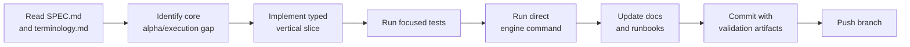

# Contributing

Status: active contribution guide.

This repository is a self-funded capital-first QuantConnect/LEAN + LLM autonomous alpha system. Darwinex/Zero is a later track-record monetization path, not the first architecture driver. Contributions must serve the active spec in [SPEC.md](SPEC.md). Do not treat this project as a generic dashboard or report app.

## Required Reading

Before changing core behavior, read:

- [SPEC.md](SPEC.md)
- [terminology.md](terminology.md)
- [AGENTS.md](AGENTS.md)
- [docs/README.md](docs/README.md)

`SPEC.md` and linked `docs/spec/*` files are long-term spec documents. Changing them changes project direction. Live-money broker writes, Darwinex/Zero adapters, leverage, derivatives, capital limits, QuantConnect promotion requirements, testing policy, credential rules, and the LLM/broker boundary require explicit user approval before implementation.

## Development Flow



Prefer vertical slices that advance:

```text
research hypothesis -> point-in-time data -> alpha -> LEAN Insight -> portfolio target -> risk -> paper trading/shadow trading artifacts -> reconciliation -> learning
```

Maximize bounded parallelism before promotion: corpus ingest, hypothesis extraction, data ingest, feature generation, LLM-derived feature jobs, ablations, backtest sweeps, and Cloud artifact imports. Keep portfolio/risk/execution/reconciliation/pre-trade risk checks single-writer and fail closed.

Do not spend major effort on UI polish while the executable alpha-to-validation loop is missing or broken.

## Commit Policy

Do **not** collapse broad work into one vague commit. Commit history should explain what was built even without reading the full diff.

Use multiple commits grouped by subsystem or evidence boundary:

- spec/doc alignment and archive moves;
- schema/entity/migration changes;
- LLM feature feed and point-in-time replay;
- QuantConnect Cloud/Object Store command loop;
- LEAN runtime changes;
- paper trading/shadow trading/reconciliation changes;
- learning/promotion ledger changes;
- README/runbook/API updates.

### Commit Message Format

Use a concise subject plus a detailed body:

```text
Implement QuantConnect Cloud artifacts loop

- Add LeanCloudRunner for cloud backtest and Object Store commands
- Record missing project/tier/credential states as blocked evidence
- Add repo wrappers for qc-cloud-backtest and qc-object-store-sync

Verification:
- backend: bun run build
- backend: bun run test -- src/modules/v1-pilot/lean/lean-cloud.runner.spec.ts
- direct: ./scripts/qc-cloud-backtest aggressive_llm_momentum -> blocked, missing cloud project
```

Good subjects:

- `Align active spec and archive superseded live-pilot docs`
- `Add canonical alpha validation schemas`
- `Implement LLM-derived feature replay`
- `Record shadow trading and promotion blockers`

Avoid:

- `update`
- `fix stuff`
- `wip`
- `final`
- `misc`

### What Belongs In The Body

For non-trivial commits, include:

- what changed;
- why it changed;
- compatibility notes for legacy identifiers;
- validation commands and results;
- exact blockers when direct execution cannot complete.

Distinguish these cases clearly:

- simulator passed vs strategy validation artifacts passed;
- pre-trade risk check blocked by policy vs command failed;
- legacy identifier retained for compatibility vs approved term for new work;
- local sample data vs QuantConnect Cloud promotion evidence.

## Testing And Evidence

Unit tests are required where they protect behavior, but they are not the final proof. Direct execution evidence is the main acceptance signal.

Run the narrowest useful commands for the touched surface:

```bash
cd backend && bun run build
cd backend && bun run test
cd backend && bun run test:e2e

cd frontend && bun run typecheck
cd frontend && bun run build
cd frontend && bun run lint
cd frontend && bun run test:run

.venv-ml/bin/python -m pytest engines/lean/aggressive_llm_momentum/tests

./scripts/run-alpha-cycle
./scripts/run-full-backtest.sh --skip-alpha-cycle --skip-market-data-ingest --no-download-data
./scripts/verify-lean-cloud-package aggressive_llm_momentum
./scripts/qc-cloud-backtest aggressive_llm_momentum
./scripts/run-paper-cycle
./scripts/run-live-shadow
./scripts/run-learning-loop
./scripts/live-preflight
```

Before a QuantConnect Cloud push, run `./scripts/verify-lean-cloud-package aggressive_llm_momentum`. The `qc-cloud-backtest --push`, `qc-cloud-push`, and `run-cloud-quality-backtest` wrappers run it automatically. Only set `SKIP_LEAN_CLOUD_PACKAGE_PREFLIGHT=true` when documenting an explicit platform blocker or emergency Cloud-only check.

If a direct command cannot pass because credentials, account tier, dataset licensing, Docker/Podman, market data, broker schema, or reconciliation evidence is missing, record the blocker exactly.

## Platform Portability

This repo moves between Apple Silicon macOS and Linux ARM64. Before platform-sensitive commands, record:

```bash
uname -s
uname -m
bun --version
python3 --version
.venv-lean-cli/bin/lean --version
```

Treat Docker/Podman, Lean CLI, Python wheels, browser tooling, native Bun/Node packages, and downloaded binaries as platform-sensitive.

## Documentation

Update documentation in the same branch as code changes.

- Root `README.md` should describe the current runnable system, not historical intent.
- `docs/README.md` should point to active spec, runbooks, API docs, decisions, and archives.
- `docs/full-lean-backtest-setup.md` should list executable commands and what each proves.
- API docs should say whether a path can mutate broker state. Under the active spec, real broker writes stay blocked.
- Use Mermaid diagrams when a workflow or boundary is easier to review visually.

## Terminology

Use terms from [terminology.md](terminology.md). Prefer precise English terms when Korean translations are ambiguous.

Required examples:

- `QuantConnect`, not `QuantConnector`;
- `LEAN`, `Lean CLI`, `QuantConnect Cloud`;
- `LLM-derived feature`;
- `point-in-time`, `availableAt`, `lookahead bias`;
- `paper trading`, `shadow trading`, `pre-trade risk check`, `reconciliation`;
- `broker-write path`, not vague “money-moving” language.

## Safety Boundary

LLMs may generate typed LLM-derived features and risk judgments. They must not:

- see broker credentials or raw account identifiers;
- generate broker request payloads;
- decide final order quantity;
- bypass deterministic risk gates;
- create non-replayable live-only decisions.

Real broker writes require a separate user-approved broker-write implementation spec.
