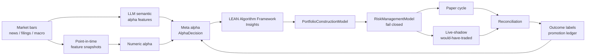
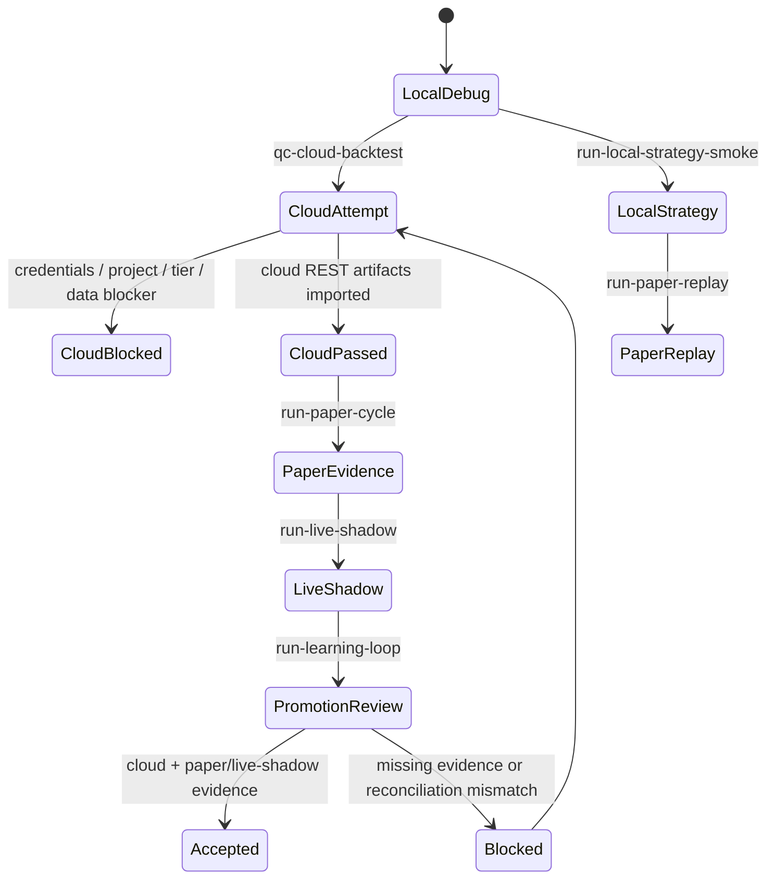
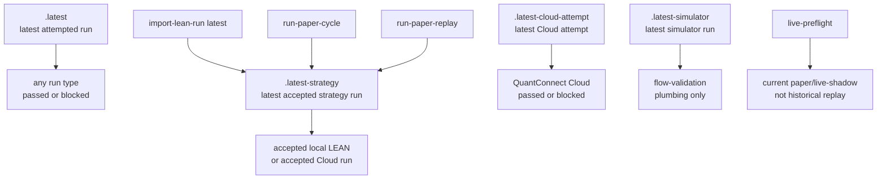
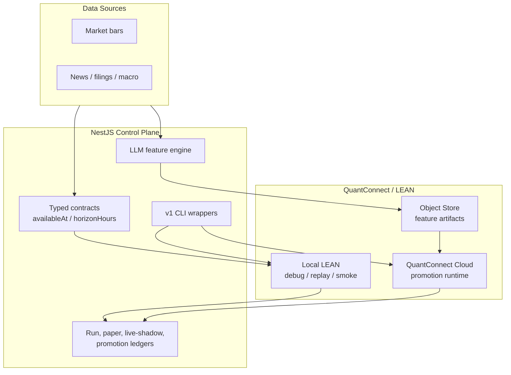

# Lincei Quant Research Engine

Status: active QuantConnect/LEAN + LLM validation system.

Last aligned: 2026-05-24.

Lincei Quant Research Engine is a personal aggressive alpha research system. The active milestone is **not** automatic live trading. The current system is built around QuantConnect Cloud, local LEAN, typed LLM semantic alpha features, paper/live-shadow evidence, reconciliation, and a learning/promotion ledger.

Read [SPEC.md](SPEC.md) first. It is the canonical long-term spec index. If any document conflicts with `SPEC.md`, `SPEC.md` wins.

## Current Direction

- LEAN / QuantConnect owns executable strategy semantics: universe selection, `AlphaModel`, `Insight`, portfolio construction, risk management, execution, orders, and fills.
- The NestJS control plane owns orchestration, run manifests, LLM feature jobs, imports, paper/live-shadow ledgers, preflight, reconciliation, and operator visibility.
- LLMs are semantic alpha engines. They convert natural-language evidence into typed point-in-time features. They do not place broker orders, see credentials, or choose final order quantity.
- Real broker writes remain blocked. `submit`, `cancel`, `replace`, `flatten`, transfer, and margin/account mutation require a future user-approved live-money spec.

## System Flow



## Evidence Gates



Local simulator and sample-data paths prove plumbing only. Promotion evidence requires imported QuantConnect Cloud artifacts plus current live-shadow evidence and reconciliation. Accepted local historical LEAN artifacts are useful strategy evidence for debugging and paper replay, but they do not replace Cloud promotion evidence. A successful `lean cloud backtest` command is not enough unless REST result artifacts are imported and pass strategy-evidence gates.

## Evidence Markers



The marker split prevents a blocked Cloud attempt or simulator smoke from overwriting the latest accepted strategy evidence. `run-paper-replay` can prove historical target plumbing, but only current paper/live-shadow evidence can satisfy live preflight and promotion gates.

## Repository Map

| Path                                                                          | Purpose                                                                 |
| ----------------------------------------------------------------------------- | ----------------------------------------------------------------------- |
| [SPEC.md](SPEC.md)                                                            | Canonical active spec index and direction lock                          |
| [terminology.md](terminology.md)                                              | Required terminology and banned AI-slop expressions                     |
| [AGENTS.md](AGENTS.md)                                                        | Agent/contributor rules for this repo                                   |
| [docs/spec/](docs/spec)                                                       | Normative split spec documents                                          |
| [docs/](docs)                                                                 | Supporting design docs, runbooks, API reference, decisions, archive     |
| [backend/](backend)                                                           | NestJS control plane, ledgers, CLI orchestration, API                   |
| [engines/lean/aggressive_llm_momentum/](engines/lean/aggressive_llm_momentum) | LEAN Algorithm Framework strategy                                       |
| [ml/](ml)                                                                     | Offline feature/model helpers and external baseline registry            |
| [frontend/](frontend)                                                         | Operational dashboard                                                   |
| [scripts/](scripts)                                                           | Repo-level wrappers for setup, LEAN, Cloud, paper/live-shadow, learning |

## Active Runtime Architecture



## Platform Support

This repo is actively moved between Apple Silicon macOS and Linux ARM64. Before platform-sensitive commands, check:

```bash
uname -s
uname -m
bun --version
python3 --version
.venv-lean-cli/bin/lean --version
```

Treat Docker/Podman, Lean CLI, Python wheels, browser tooling, native Bun/Node packages, and downloaded binaries as platform-sensitive.

The latest validated platform snapshot for this branch was:

- `Linux aarch64`
- Bun `1.3.14`
- Python `3.12.3`
- Lean CLI `1.0.225`

## Setup

`git clone` alone is not enough. Secrets, local data, dependency directories, LEAN workspace, generated artifacts, and local SQLite databases are intentionally gitignored.

### Prerequisites

| Tool                                   | Used for                                       |
| -------------------------------------- | ---------------------------------------------- |
| Bun                                    | Backend, frontend, CLI wrappers                |
| Python 3.10+                           | ML venv and Lean CLI venv                      |
| Docker or Podman-compatible Docker CLI | Local LEAN container runs                      |
| QuantConnect account/API token         | Cloud backtests, workspace setup, Object Store |
| OpenAI API key                         | LLM semantic alpha features                    |

### Bootstrap

```bash
git clone <repository-url>
cd lincei-quant-research-engine
cp .env.example .env

# Fill QUANTCONNECT_USER_ID, QUANTCONNECT_API_TOKEN, OPENAI_API_KEY as needed.
./scripts/bootstrap-dev.sh
```

Manual setup commands:

```bash
./scripts/setup-ml-venv.sh
./scripts/setup-lean-cli.sh
./scripts/lean-login-from-env.sh
./scripts/setup-lean-workspace.sh

cd backend && bun install
cd ../frontend && bun install
```

QuantConnect local data is not downloaded by bootstrap. See [docs/full-lean-backtest-setup.md](docs/full-lean-backtest-setup.md) for ticker data commands and costs.

## Command Cheat Sheet

Run from repository root unless noted.

```bash
# Alpha and feature generation
./scripts/run-alpha-cycle

# Local LEAN and import
./scripts/lean-backtest aggressive_llm_momentum
./scripts/import-lean-run latest
./scripts/run-full-backtest.sh --skip-alpha-cycle --skip-market-data-ingest --no-download-data
./scripts/run-local-strategy-smoke

# QuantConnect Cloud / Object Store
./scripts/qc-cloud-backtest aggressive_llm_momentum
./scripts/qc-cloud-push aggressive_llm_momentum
./scripts/qc-object-store-sync lincei/llm-features/latest.json

# Paper, live-shadow, learning, broker-write preflight
./scripts/run-paper-cycle
./scripts/run-paper-replay
./scripts/run-live-shadow
./scripts/run-learning-loop
./scripts/live-preflight
# Legacy compatibility command; always blocked under active SPEC.md.
./scripts/live-pilot-10usd --confirm-real-money
```

Exit code `2` means policy/account/platform `blocked` evidence, not a crash. Examples: missing QuantConnect Cloud project, missing Cloud account tier, failed strategy-evidence gates, missing paper target evidence, or blocked live-money preflight.

## Current Implementation Status

Implemented in this branch:

- Canonical typed contracts around `availableAt`, `horizonHours`, LEAN runtime/mode/status, LLM feature refs, live-shadow records, outcome labels, and promotion decisions.
- Raw evidence archive from existing news records into point-in-time evidence rows.
- LLM semantic feature generation with point-in-time evidence filtering and replayable abstain/flat records when LLM or eligible evidence is unavailable.
- LEAN replay helper for `llm_event_features.json` with future-`availableAt` rejection.
- Static meta-alpha and ML artifact replay now ignores records whose `availableAt` is in the simulated future.
- QuantConnect Cloud backtest/Object Store wrapper commands that record passed/blocked local evidence and import Cloud REST statistics, insights, orders, and derived order-target evidence when credentials are configured.
- Split latest-run markers: `.latest`, `.latest-strategy`, `.latest-simulator`, and `.latest-cloud-attempt` so simulator/cloud attempts cannot displace accepted strategy evidence.
- Current paper cycle remains strict about fresh market data; historical paper replay is explicit `paper-replay` evidence and is ignored by live preflight.
- Live-shadow would-have-traded ledger with broker writes disabled and explicit `evidenceMode` (`historical_target_replay` vs `current_live_shadow`).
- Learning loop with outcome labeling from `max(asOf, availableAt)` where market bars are available and promotion decisions that block without Cloud + live-shadow evidence.
- Legacy live-money command surface that always records blocked evidence and never creates broker-write intents under the active spec.

Known current blockers from direct verification:

- `qc-cloud-backtest aggressive_llm_momentum` needs a Cloud project plus `QC_PROJECT_ID`/`QUANTCONNECT_PROJECT_ID`, `QC_USER_ID`/`QUANTCONNECT_USER_ID`, and `QC_API_TOKEN`/`QUANTCONNECT_API_TOKEN` before REST result import can become promotion evidence.
- Local LEAN strategy-evidence works on Linux ARM64 through the Docker group fallback when direct socket access is stale in the current shell.
- `run-paper-cycle` is expected to block on stale historical targets unless a current target snapshot exists; use `run-paper-replay` for plumbing checks that must not satisfy live preflight.
- Promotion remains blocked until QuantConnect Cloud evidence and `current_live_shadow` evidence are both present.

## Verification

Primary proof is direct execution. Unit tests support that proof but do not replace it.

Complete gate before merging broad changes:

```bash
cd backend && bun run build
cd backend && bun run test
cd backend && bun run test:e2e

cd frontend && bun run typecheck
cd frontend && bun run build
cd frontend && bun run lint
cd frontend && bun run test:run

.venv-ml/bin/python -m pytest engines/lean/aggressive_llm_momentum/tests
python3 -m py_compile engines/lean/aggressive_llm_momentum/alpha/semantic_features.py
git diff --check
```

Latest direct verification on 2026-05-24 UTC:

- `cd backend && bun run build` passed.
- Targeted backend Jest passed: repo env loader, LEAN import, paper bridge, live preflight, Cloud runner, and learning loop.
- `./scripts/run-local-strategy-smoke` passed on Linux ARM64 through the in-process `sg docker` fallback. Latest accepted local strategy run: `bt-20260524104630-4495ff89`.
- `./scripts/import-lean-run latest` reads `.latest-strategy` and still imports `bt-20260524104630-4495ff89` even after a blocked Cloud attempt moves `.latest`.
- `./scripts/run-paper-cycle` returned exit code `2` with stale market data and paper approval blockers. This is the expected strict current-market behavior for historical LEAN targets.
- `./scripts/run-paper-replay` returned exit code `0` and created a reconciled paper replay plan for historical target plumbing.
- `./scripts/run-live-shadow` returned exit code `0` with `evidenceMode: historical_target_replay`.
- `./scripts/run-learning-loop` returned exit code `2` because the latest LEAN run is local, not QuantConnect Cloud, and live-shadow evidence is historical replay rather than `current_live_shadow`.
- `./scripts/live-preflight` returned exit code `2`; it ignored paper replay evidence and stayed blocked on missing current paper cycle, simulated broker snapshot, broker flags, and credentials.
- `./scripts/qc-cloud-backtest aggressive_llm_momentum` returned exit code `2` with missing QuantConnect Cloud project blocker.
- `./scripts/run-v1-cycle --skip-alpha-cycle --skip-market-data-ingest --no-download-data` returned exit code `0`: local backtest passed, paper cycle blocked by explicit gates, and live preflight recorded blocked evidence.

## Documentation

- [Documentation Index](docs/README.md)
- [API Reference](docs/api-reference.md)
- [Development Guide](docs/development-guide.md)
- [Deployment Guide](docs/deployment-guide.md)
- [LEAN Backtest And Readiness Paths](docs/full-lean-backtest-setup.md)
- [Execution Readiness](docs/execution-readiness.md)
- [QuantConnect Realignment Decision](docs/decisions/2026-05-24-quantconnect-realignment.md)

## Contributing

Read [CONTRIBUTING.md](CONTRIBUTING.md), [AGENTS.md](AGENTS.md), and [terminology.md](terminology.md) before changing core behavior.

Important rules:

- Do not modify `SPEC.md` or `docs/spec/*` to expand live-money scope without explicit user approval.
- Use standard English engineering and quantitative-finance terms from `terminology.md`.
- Keep implementation files small and typed; prefer domain models over loose dictionaries.
- Commit in meaningful, reviewable chunks with detailed commit messages and verification evidence.

## License

ISC
