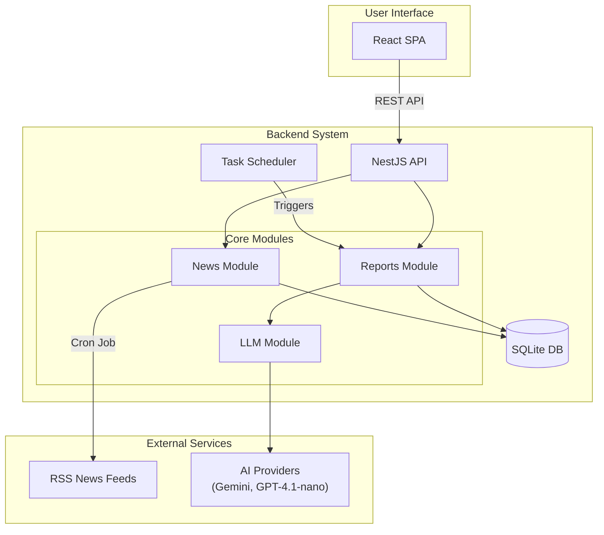
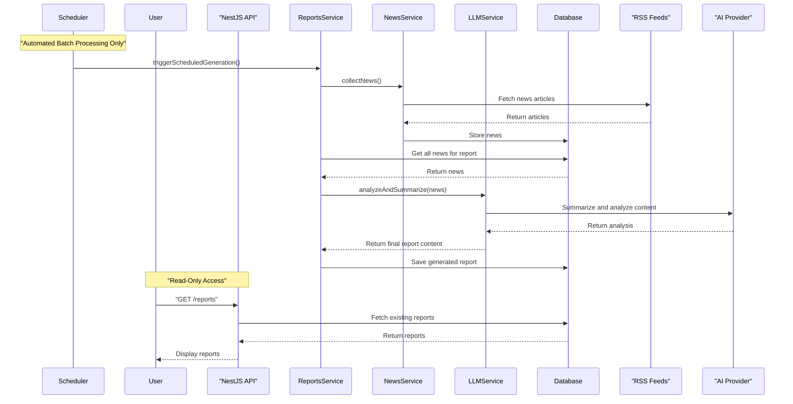
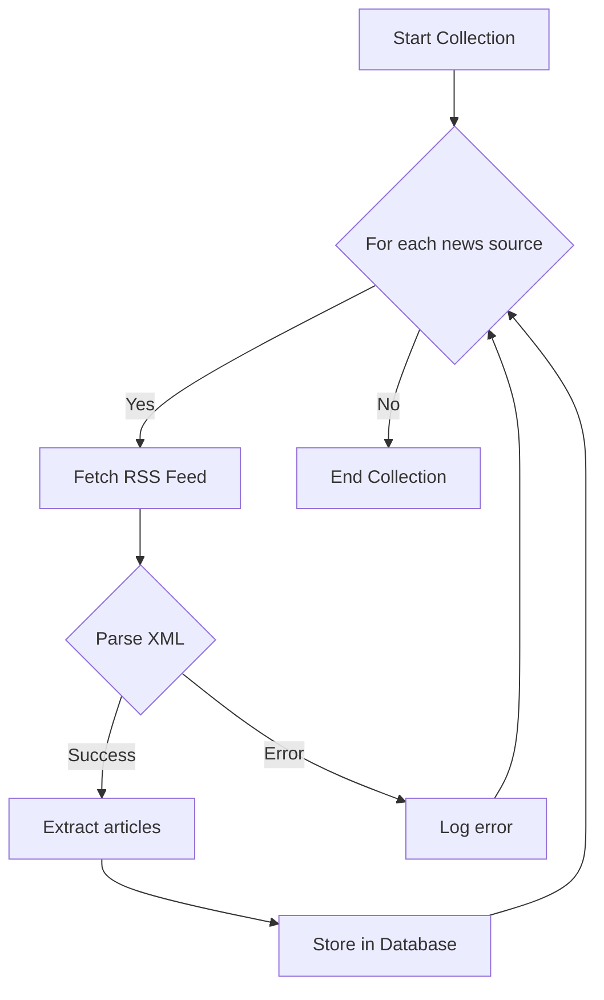

# Lincei Quant Research Engine

Autonomous alpha system for aggressive personal capital growth.

The project is being redesigned around a real executable core:

- LEAN / QuantConnect for strategy, backtest, paper, and live runtime semantics;
- LLM Alpha Committee for research, event interpretation, and alpha judgment;
- deterministic portfolio construction, risk, broker, and ledger boundaries;
- a control plane and dashboard that observe and control the engine rather than replacing it.

The current repo still contains the original investment report app and a growing control-plane foundation. The critical next step is integrating the LEAN/QuantConnect execution engine.

## Clone on a new machine

`git clone` alone is not enough. Several paths are **gitignored** and must be created or downloaded on each machine.

### What Git does **not** include

| Item | In repo? | How to obtain |
|------|----------|----------------|
| **Secrets** (`.env`) | No | Copy `.env.example` → `.env` at **repo root** and fill keys (see below). |
| **Node deps** (`backend/node_modules`, `frontend/node_modules`) | No | `bun install` in each app (or `./scripts/bootstrap-dev.sh`). |
| **Lean CLI venv** (`.venv-lean-cli/`) | No | `./scripts/setup-lean-cli.sh` |
| **ML venv** (`.venv-ml/`) | No | `./scripts/setup-ml-venv.sh` |
| **LEAN workspace** (`engines/lean/lean.json`, `engines/lean/data/`) | No | `./scripts/lean-login-from-env.sh` then `./scripts/setup-lean-workspace.sh` |
| **QC market bars** (full universe, 2024–2025) | No | `lean data download` — see `docs/full-lean-backtest-setup.md` |
| **External ML baselines** (LightGBM on Hugging Face) | No | `./scripts/download-external-baselines` (needs `.venv-ml`) |
| **Runtime alpha inputs** (`engines/lean/aggressive_llm_momentum/input/meta_decisions.json`, `ml_predictions.json`) | No | Generated by `run-alpha-cycle` / ML inference |
| **Backtest outputs** (`artifacts/lean-runs/`, `engines/lean/**/backtests/`) | No | Produced by `lean backtest` / `run-full-backtest` |
| **SQLite DB** (`backend/data/*.db`) | No | Auto-created on first Nest start (path from `DATABASE_PATH` in `.env`) |
| **QC CLI credentials file** (`~/.lean/credentials` on your OS user) | No | Written by `./scripts/lean-login-from-env.sh` from `.env` |
| **Optional reference clones** (`references/projects/*`) | No | Manual clone for inspection — see `references/reference-register.md` |

Nothing in the table above needs to be copied from another laptop except **`.env`** (and any custom files you created outside the repo).

### Prerequisites (install on the OS yourself)

| Tool | Used for |
|------|----------|
| [Bun](https://bun.sh) | Backend, frontend, `bun run v1:cli` |
| [Docker Desktop](https://www.docker.com/products/docker-desktop/) | `lean backtest` (LEAN engine in container) |
| **Python 3.10+** | `.venv-ml`, `.venv-lean-cli` |
| **macOS only:** `libomp` (Homebrew) | LightGBM in `.venv-ml` — `brew install libomp` |

### One-shot bootstrap (recommended)

From the **repository root**:

```bash
git clone <repository-url>
cd lincei-quant-research-engine
git checkout codex/full-autonomous-live-pilot-v1   # or your target branch

cp .env.example .env
# Edit .env: QUANTCONNECT_* , OPENAI_* , optional STOOQ_API_KEY

chmod +x scripts/bootstrap-dev.sh
./scripts/bootstrap-dev.sh
```

`bootstrap-dev.sh` runs: ML venv, Lean CLI venv, `bun install` (backend + frontend), Hugging Face baseline download, optional `lean login` + `lean init` when QC vars are set.

It does **not** download full QuantConnect equity history; do that once per machine (next section).

### After bootstrap — LEAN data (manual, once)

1. Log in: `./scripts/lean-login-from-env.sh` (reads repo-root `.env`).
2. Workspace: `./scripts/setup-lean-workspace.sh` if `engines/lean/lean.json` is missing.
3. Download bars for the V1 universe (`SPY`, `QQQ`, `IWM`, `TLT`, `GLD`) — commands in `docs/full-lean-backtest-setup.md`.

For a **smoke run only** (no QC download, short sample window, not performance validation):

```bash
cd backend
ALLOW_SYNTHETIC_FEATURES=true bun run v1:cli -- run-full-backtest --no-download-data
```

### Environment file

| File | Role |
|------|------|
| **`.env`** (repo root) | **Canonical for V1** — loaded by `backend/src/shared/repo-env.loader.ts` |
| `backend/.env.example` | Extended template (duplicate of many keys; use if you prefer env only under `backend/`) |
| `.env.example` | Root template — copy to `.env` |

Required for V1 LEAN + LLM pipeline:

- `QUANTCONNECT_USER_ID`, `QUANTCONNECT_API_TOKEN`
- `OPENAI_API_KEY`, `OPENAI_MODEL` (e.g. `gpt-5.5`), `OPENAI_REASONING_EFFORT=medium`

Optional but recommended for real market features (avoid synthetic placeholders):

- `STOOQ_API_KEY`
- Keep `ALLOW_SYNTHETIC_FEATURES=false` for research runs

### V1 command cheat sheet

```bash
cd backend
bun run v1:cli -- run-alpha-cycle
bun run v1:cli -- lean-backtest
bun run v1:cli -- import-lean-run latest
bun run v1:cli -- run-full-backtest          # Docker + QC data
```

Wrappers from repo root: `./scripts/run-alpha-cycle`, `./scripts/run-full-backtest.sh`, etc.

### Handoff / review docs (V1 experiment)

- `docs/handoff-2026-05-23-v1-lean-experiment.md` — what the last run actually proved
- `docs/review-prompt-v1-lean-experiment-handoff.md` — prompt for external AI review
- `docs/full-lean-backtest-setup.md` — LEAN paths, Bun, Docker, data download

## Current Project Docs

- System spec: [SPEC.md](SPEC.md)
- Architecture: [docs/project-architecture.md](docs/project-architecture.md)
- LEAN / QuantConnect engine plan: [docs/lean-quantconnect-engine.md](docs/lean-quantconnect-engine.md)
- Alpha model design: [docs/alpha-model-design.md](docs/alpha-model-design.md)
- LLM Alpha Committee: [docs/llm-alpha-committee.md](docs/llm-alpha-committee.md)
- Latency and execution paths: [docs/latency-and-execution-paths.md](docs/latency-and-execution-paths.md)
- Model training plan: [docs/model-training-plan.md](docs/model-training-plan.md)
- Implementation roadmap: [docs/implementation-roadmap.md](docs/implementation-roadmap.md)
- Research references: [docs/research-references.md](docs/research-references.md)

## System Architecture

The diagram below describes the legacy report app. The target architecture is documented in [docs/project-architecture.md](docs/project-architecture.md).



## Report Generation Flow

Investment reports are automatically generated via scheduled batch jobs twice daily (8 AM, 6 PM KST). No manual report generation is supported to control AI costs and ensure consistent timing.



## News Collection Process



## Tech Stack

| Component | Technology |
|-----------|------------|
| Frontend  | React 19, TypeScript, Tailwind CSS |
| Backend   | NestJS, TypeScript, TypeORM |
| Database  | SQLite |
| AI        | Gemini 2.5 Flash (reports), OpenAI (V1 LLM alpha) |
| V1 runtime | Bun, LEAN CLI (Docker), Python ML venv |

## Autonomous Control Plane

This repo is moving toward an autonomous investment control plane, but it is not a live-trading bot yet.

- System spec: [SPEC.md](SPEC.md)
- Execution readiness: [docs/execution-readiness.md](docs/execution-readiness.md)
- Toss Open API readiness: [docs/toss-open-api-readiness.md](docs/toss-open-api-readiness.md)
- Local reference projects: [references/reference-register.md](references/reference-register.md)

## Quick Start

**New machine:** follow [Clone on a new machine](#clone-on-a-new-machine) first (`./scripts/bootstrap-dev.sh`).

### For Development (legacy report app + API)

Uses **Bun** for installs (see `backend/package.json`). V1 pilot uses `bun run v1:cli` from `backend/`.

```bash
git clone <repository-url>
cd lincei-quant-research-engine
cp .env.example .env
# Add GEMINI_API_KEY (reports) and V1 keys as needed

./scripts/bootstrap-dev.sh

cd backend
bun run start:dev

# Another terminal
cd frontend
bun run dev
```

### For Production (Docker)

```bash
# Clone and setup environment
git clone <repository-url>
cd auto-investment-helper
cp backend/.env.example backend/.env
# Add your GEMINI_API_KEY to backend/.env

# Build and run with Docker Compose
docker-compose up --build
```

**Endpoints:**
- Backend: `http://localhost:3001`
- Frontend: `http://localhost:3000`

## Development

Each service runs independently. Navigate to the service directory and use standard npm commands.

### Backend Development
```bash
cd backend

# Install dependencies
npm install

# Development with hot-reload
npm run start:dev

# Build for production
npm run build

# Run tests
npm run test:all

# Lint and format
npm run lint
npm run format
```

### Frontend Development
```bash
cd frontend

# Install dependencies
npm install

# Development server
npm start

# Build for production
npm run build

# Run tests
npm run test:coverage

# Lint and format
npm run lint
npm run format
```

## Production Deployment

Use Docker Compose for production deployment:

```bash
# Build and start all services
docker-compose up --build

# Run in background
docker-compose up -d

# Stop services
docker-compose down

# View logs
docker-compose logs -f
```

  ## Testing Framework

This project includes a comprehensive testing framework for validating batch processing operations without waiting for scheduled jobs.

### Testing Dashboard

Access the testing dashboard at `/testing` in the frontend to:

- **Monitor system health** - Check service status and metrics
- **Create mock data** - Generate test news articles for testing
- **Run test suites** - Execute automated test scenarios
- **Manual testing** - Trigger batch operations manually
- **Performance monitoring** - Track operation timing and resource usage

### Test Suites

#### News Collection Suite (`news-collection`)
- Basic news collection validation
- Performance testing (< 30 seconds)
- Error handling verification

#### Report Generation Suite (`report-generation`)  
- Morning/evening report generation
- Content structure validation
- No-news scenario handling

#### Integration Suite (`integration`)
- End-to-end pipeline testing
- Concurrent operation testing
- Data consistency validation

### Testing API Endpoints

| Endpoint | Purpose |
|----------|---------|
| `GET /test/health` | System health status |
| `GET /test/suites` | Available test suites |
| `POST /test/suites/:name/run` | Execute test suite |
| `POST /test/data/mock-news` | Create mock news |
| `DELETE /test/data/cleanup` | Clean test data |
| `POST /reports/test/generate/:type` | Manual report generation |
| `POST /reports/test/flow/full` | Complete pipeline test |

### Running Tests

```bash
# Backend unit tests
cd backend && npm run test

# Backend E2E tests  
cd backend && npm run test:e2e

# Frontend tests
cd frontend && npm run test

# All tests
npm run test:all
```

For detailed testing documentation, see [TESTING.md](./TESTING.md).

## API Reference

- `GET /reports` - List reports (paginated)
- `GET /reports/:id` - Get specific report  
- `GET /news/stats` - News collection statistics
- `GET /scheduler/status` - Batch job status (monitoring)
- `GET /health` - Service health check

## Configuration

Key service files for customization:

- **News Sources**: `backend/src/modules/news/news.service.ts`
- **AI Models**: `backend/src/modules/llm/llm.service.ts`  
- **Scheduling**: `backend/src/modules/reports/scheduler.service.ts`

## Documentation

- [API Reference](./docs/api-reference.md)
- [Development Guide](./docs/development-guide.md)
- [Deployment Guide](./docs/deployment-guide.md)

## License

ISC

## Notes

- Gemini API key required
- Check database paths and security settings for production
- Monitor API usage costs
- This project leverages AI development tools (Claude Code, Cursor) for enhanced development workflow and code quality
