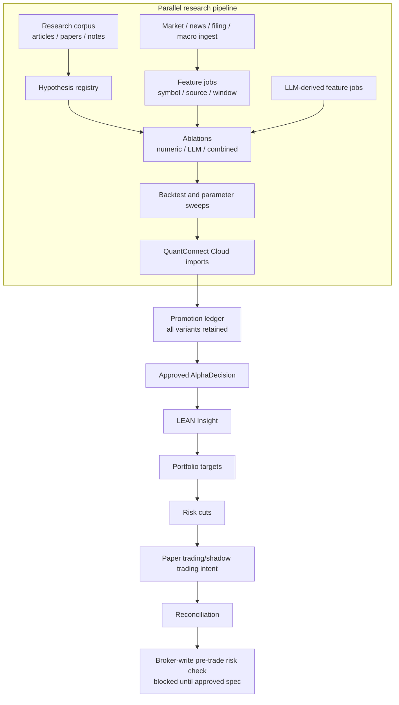
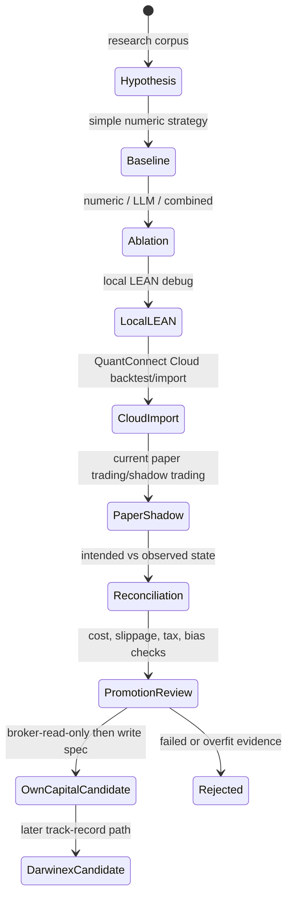

# Lincei Quant Research Engine

Status: active self-funded capital-first QuantConnect/LEAN + LLM alpha system.

Last aligned: 2026-05-27.

Lincei is a personal autonomous alpha system whose first monetization goal is self-funded capital allocation: running continuously, researching strategies, collecting validation artifacts, and eventually trading the operator's own pre-funded capital only after promotion evidence, pre-trade risk checks, and reconciliation gates pass.

Darwinex/Zero is a later monetization path. It should not drive the first architecture. A Darwinex/Zero track record is useful only after the self-funded capital loop can produce a defensible signal and execution record.

Read [SPEC.md](SPEC.md) first. It is the canonical active spec index. If another document conflicts with `SPEC.md`, `SPEC.md` wins.

## Direction

- Self-funded capital allocation is the priority.
- QuantConnect Cloud and LEAN are the strategy validation/runtime foundation.
- The Oracle Cloud ARM server is the intended always-on control plane for scheduling research, data, feature, ablation, import, paper trading/shadow trading, reconciliation, and alert jobs.
- LLMs are LLM-derived feature generators, not allocators and not broker operators.
- Parallelization is expected before promotion: corpus ingest, hypothesis extraction, data ingest, feature jobs, LLM jobs, ablations, backtests, and Cloud artifact imports should run concurrently where safe.
- Execution-like work is single-writer: promotion, portfolio target consolidation, risk cuts, paper trading/shadow trading intent, reconciliation, and broker-write pre-trade risk checks must have one canonical state.
- Real broker writes remain blocked until a separate broker-write implementation spec is approved.

## Core Hypothesis

The project hypothesis is:

> A point-in-time parallel research pipeline that combines durable numeric baselines, ML features, and LLM-derived features can produce after-cost, benchmark-relative returns that survive QuantConnect Cloud validation, current paper trading/shadow trading artifacts, reconciliation, and later self-funded capital execution.

The Alpha Architect corpus review changes the near-term priority:

1. Prove simple liquid baselines first: trend following, defensive allocation, momentum, daily-return features, and cost-aware rebalancing.
2. Add LLM-derived alpha only as typed features and ablations.
3. Treat factor crowding, factor valuation, macro regimes, index effects, and filing language as research hypotheses that need broader data and vintage controls.
4. Revisit Darwinex/Zero after the self-funded capital deployment-grade track record exists.

## System Flow



Parallel jobs improve research throughput. They do not create multiple execution truths. The system can evaluate many hypotheses at once, but only one consolidated target set can advance toward execution evidence for a given strategy/account/time.

## Evidence Ladder



Promotion requires direct supporting evidence. Unit tests protect schemas and API contracts, but they do not prove strategy performance or broker-write readiness.

## Research Corpus

The repo stores an initial Alpha Architect corpus for strategy research:

- [references/alphaarchitect/README.md](references/alphaarchitect/README.md)
- [references/alphaarchitect/index.json](references/alphaarchitect/index.json)
- [references/alphaarchitect/strategy-register.md](references/alphaarchitect/strategy-register.md)
- [docs/own-capital-alphaarchitect-corpus-review.md](docs/own-capital-alphaarchitect-corpus-review.md)

The corpus contains 40 sourced articles with metadata and content hashes. It is a hypothesis library, not trading evidence. A stored article becomes useful only after it is mapped to point-in-time data, implemented as a LEAN strategy or feature, and validated through the evidence ladder.

## Current Architecture

| Layer               | Role                                                                                                               |
| ------------------- | ------------------------------------------------------------------------------------------------------------------ |
| Research corpus     | Stores articles, papers, source metadata, content hashes, and hypothesis candidates.                               |
| Hypothesis registry | Converts research into testable strategy variants and failure modes.                                               |
| Feature store       | Preserves point-in-time and vintage features with `availableAt`, source refs, and hashes.                          |
| LLM-derived alpha   | Extracts structured features from text evidence; never emits broker instructions.                                  |
| Numeric/ML alpha    | Provides simple baselines and model features for ablation.                                                         |
| LEAN / QuantConnect | Owns strategy runtime semantics: `Insight`, portfolio construction, risk, execution in approved modes.             |
| Control plane       | Orchestrates jobs, imports artifacts, records ledgers, reconciliation, pre-trade risk checks, and dashboard state. |
| Broker boundary     | Read-only and pre-trade risk checks first; broker writes require a future approved spec.                           |

## Repository Map

| Path                                                                                                 | Purpose                                                      |
| ---------------------------------------------------------------------------------------------------- | ------------------------------------------------------------ |
| [SPEC.md](SPEC.md)                                                                                   | Canonical active spec index                                  |
| [AGENTS.md](AGENTS.md)                                                                               | Agent/contributor rules                                      |
| [terminology.md](terminology.md)                                                                     | Canonical terms                                              |
| [docs/spec/](docs/spec)                                                                              | Normative split spec                                         |
| [docs/own-capital-alphaarchitect-corpus-review.md](docs/own-capital-alphaarchitect-corpus-review.md) | Self-funded capital architecture review from research corpus |
| [references/alphaarchitect/](references/alphaarchitect)                                              | Stored Alpha Architect article corpus and strategy register  |
| [config/universes/](config/universes)                                                                | Universe manifests and caps                                  |
| [backend/](backend)                                                                                  | NestJS control plane and ledgers                             |
| [engines/lean/aggressive_llm_momentum/](engines/lean/aggressive_llm_momentum)                        | LEAN Algorithm Framework strategy                            |
| [ml/](ml)                                                                                            | Offline feature/model helpers                                |
| [frontend/](frontend)                                                                                | Operational dashboard                                        |
| [scripts/](scripts)                                                                                  | Operator command wrappers                                    |

## Implementation Status

Implemented in the current branch:

- durable research hypothesis registry and parallel research job ledger;
- Alpha Architect corpus-to-hypothesis ingestion script with idempotent job records;
- multiple-testing bias promotion check that blocks when only winning/no variant evidence exists;
- point-in-time text evidence ingestion, including Hugging Face FOMC evidence;
- QuantConnect Cloud project/backtest listing and manual Cloud backtest import;
- paginated Cloud insights/orders import with Cloud id preservation;
- paper replay separated from current paper trading/shadow trading readiness;
- backtest-cycle dashboard;
- Alpha Architect corpus with 40 sourced articles and self-funded capital strategy review;
- long-term specs for self-funded capital priority, Darwinex/Zero deferral, and parallel research pipeline.

Not implemented yet:

- broad research universe profiles separate from the current theme universe;
- complete vintage-data store for restatable sources;
- simple trend/momentum/daily-return baselines with promotion evidence;
- broker-read-only reconciliation;
- broker-write adapter;
- Darwinex/Zero execution or track-record adapter.

## Setup

`git clone` alone is not enough. Secrets, local data, LEAN workspace state, generated artifacts, and SQLite databases are intentionally gitignored.

Prerequisites:

| Tool                                   | Used for                                       |
| -------------------------------------- | ---------------------------------------------- |
| Bun                                    | Backend, frontend, CLI wrappers                |
| Python 3.10+                           | ML helpers and Lean CLI venv                   |
| Docker or Podman-compatible Docker CLI | Local LEAN container runs                      |
| QuantConnect account/API token         | Cloud backtests, workspace setup, Object Store |
| OpenAI-compatible API key              | LLM-derived features                           |
| Oracle Cloud ARM host                  | Optional always-on control plane target        |

Bootstrap:

```bash
git clone <repository-url>
cd lincei-quant-research-engine
cp .env.example .env

# Fill QUANTCONNECT_USER_ID, QUANTCONNECT_API_TOKEN, OPENAI_API_KEY as needed.
./scripts/bootstrap-dev.sh
```

## Command Cheat Sheet

Run from repository root unless noted.

```bash
# Research and text evidence
./scripts/build-hypothesis-registry
./scripts/run-selected-run-bias-check
./scripts/ingest-semantic-evidence --source hf-fomc-statements-minutes --limit 80
./scripts/run-alpha-cycle

# Local LEAN and import
./scripts/lean-backtest aggressive_llm_momentum
./scripts/import-lean-run latest
./scripts/run-local-strategy-smoke
./scripts/verify-lean-cloud-package aggressive_llm_momentum

# QuantConnect Cloud
./scripts/list-cloud-projects
./scripts/list-cloud-backtests --project-id <project-id> --limit 10
./scripts/import-cloud-backtest --project-id <project-id> --backtest-id <backtest-id>
./scripts/qc-cloud-backtest aggressive_llm_momentum
./scripts/qc-cloud-push aggressive_llm_momentum

# Paper trading, shadow trading, learning, broker-write pre-trade risk check
./scripts/run-paper-cycle
./scripts/run-paper-replay
./scripts/run-live-shadow
./scripts/run-learning-loop
./scripts/live-preflight
```

Exit code `2` means a policy/account/platform `blocked` result, not necessarily a crash. Examples include missing QuantConnect Cloud credentials, account-tier blockers, missing current paper trading/shadow trading artifacts, stale targets, data-license blockers, or broker-write pre-trade risk check blockers.

## Verification

Use the narrowest command that proves the touched surface:

```bash
git diff --check

cd backend && bun run build
cd backend && bun run test

cd frontend && bun run typecheck
cd frontend && bun run build
cd frontend && bun run test:run

.venv-ml/bin/python -m pytest engines/lean/aggressive_llm_momentum/tests
./scripts/verify-lean-cloud-package aggressive_llm_momentum
./scripts/run-local-strategy-smoke
./scripts/run-cloud-quality-backtest
./scripts/run-paper-cycle
./scripts/run-live-shadow
./scripts/run-learning-loop
./scripts/live-preflight
```

Final reports must separate unit-test evidence, local LEAN evidence, QuantConnect Cloud artifacts, paper trading/shadow trading evidence, reconciliation evidence, and blockers.

## Key Rule

Build the self-funded capital loop before anything else:

```text
hypothesis -> baseline -> ablation -> Cloud artifacts -> current paper trading/shadow trading -> reconciliation -> broker-read-only -> broker-write spec
```

Everything else is supporting infrastructure.
