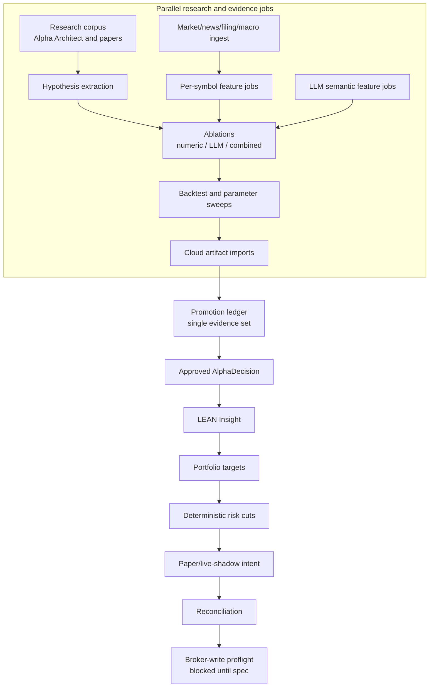

# Lincei Quant Research Engine Specification

Status: active long-term specification.

Last aligned: 2026-05-27.

## Spec Authority

This file is the canonical index for the active project specification. Documents linked from this file are normative unless they are explicitly marked supporting, archived, or historical.

Older dated handoffs, prompts, review notes, and archived plans are historical context only. They cannot override this spec.

The 2026-05-27 direction change approves the long-term objective of own-capital allocation and later Darwinex/Zero monetization. It does not approve immediate broker writes, exact capital limits, leverage, derivatives, shorts, margin, or any broker/Darwinex adapter implementation. Those still require the dedicated specs and gates named below.

## Current Direction Lock

The first monetization priority is own-capital allocation: the operator wants this system to run continuously, research strategies, validate hypotheses, and eventually trade the operator's own pre-funded capital only after evidence, risk, preflight, and reconciliation gates pass.

Darwinex/Zero is a second-order path. It matters only after the own-capital-grade signal and track record exist. The repository must not prioritize Darwinex adapter work ahead of the own-capital evidence loop.

The current milestone is still not automatic production/live trading. It is the validated capital-allocation loop:

```text
research corpus
  -> hypothesis registry
  -> point-in-time and vintage data
  -> parallel feature and alpha jobs
  -> LEAN / QuantConnect validation
  -> portfolio and risk consolidation
  -> paper/live-shadow evidence
  -> reconciliation
  -> learning and promotion ledger
  -> own-capital broker-write candidate
```

Real-money broker writes are long-term in scope but blocked in the current milestone. Any path that can submit, cancel, replace, flatten, transfer, or mutate margin/account settings needs a user-approved broker-write implementation spec before implementation.

## Core Product Thesis

The project hypothesis is:

> A point-in-time research factory that combines simple numeric baselines, ML features, and LLM semantic alpha features can produce after-cost, benchmark-relative returns that survive QuantConnect Cloud validation, current paper/live-shadow evidence, reconciliation, and later own-capital execution.

The Alpha Architect corpus review tightened the priority:

1. Start with robust, boring baselines: liquid ETF trend following, defensive allocation, momentum, daily-return features, and cost-aware rebalancing.
2. Add LLM semantic alpha only as typed features and ablations, not as an allocator.
3. Treat factor crowding, factor valuation, anomaly demand, macro regimes, and filing language as research hypotheses that need broader data and vintage controls before promotion.
4. Keep Darwinex/Zero deferred until the own-capital path can produce an independently defensible track record.

## Parallelization Principle

Maximize safe parallelism everywhere before portfolio/risk consolidation:

```text
research article ingestion
  || hypothesis extraction
  || market/news/filing/macro ingestion
  || per-symbol feature generation
  || LLM semantic feature jobs
  || numeric-only / LLM-only / combined ablations
  || parameter and backtest sweeps
  || QuantConnect Cloud artifact page imports
```

Then force a single canonical path:

```text
promotion ledger
  -> portfolio target consolidation
  -> deterministic risk cuts
  -> paper/live-shadow execution intent
  -> reconciliation
  -> broker-write preflight
```

Parallel work must be bounded, idempotent, and replayable. Every job needs a run id, input hash, output hash, status, retry policy, cost record when applicable, and blocker reason. Failed, flat, blocked, and losing runs are part of the evidence set.

## Required Reading

Read these documents in order before changing core behavior:

1. [Direction And Change Control](docs/spec/00-direction-and-change-control.md): product direction, approval rules, non-goals, and subscription posture.
2. [Terminology](terminology.md): canonical engineering and quant terms.
3. [QuantConnect And LEAN Runtime](docs/spec/01-quantconnect-lean-runtime.md): role split between LEAN, QuantConnect Cloud, local LEAN, and the repo control plane.
4. [LLM Semantic Alpha Engine](docs/spec/02-llm-semantic-alpha-engine.md): LLM permissions and replayable semantic alpha contracts.
5. [Data Sources And Feature Store](docs/spec/03-data-sources-and-feature-store.md): point-in-time, vintage, raw evidence, and feature contracts.
6. [Risk, Execution, And Broker Boundary](docs/spec/04-risk-execution-and-broker-boundary.md): portfolio/risk/execution boundary and fail-closed broker rules.
7. [Testing And Verification Policy](docs/spec/05-testing-and-verification.md): direct execution evidence and failure-case requirements.
8. [Implementation Roadmap](docs/spec/06-implementation-roadmap.md): current phase sequence and acceptance criteria.
9. [References](docs/spec/07-references.md): official platform docs and research sources.
10. [Quality-Gated Universe](docs/spec/08-quality-gated-universe.md): active universe policy and caps.
11. [Dual Monetization And Operations](docs/spec/09-dual-monetization-and-operations.md): own-capital priority, Oracle Cloud ARM operations, Darwinex/Zero posture, strategy corpus, and vintage-data rules.
12. [Parallel Research Factory](docs/spec/10-parallel-research-factory.md): parallel job boundaries, idempotency, selected-run-bias controls, and single-writer execution gates.

Supporting docs:

- [Own-Capital Architecture Review From Alpha Architect Corpus](docs/own-capital-alphaarchitect-corpus-review.md)
- [Alpha Architect Strategy Register](references/alphaarchitect/strategy-register.md)
- [Research References](docs/research-references.md)
- [LEAN and QuantConnect Engine](docs/lean-quantconnect-engine.md)
- [Alpha Model Design](docs/alpha-model-design.md)
- [LLM Alpha Committee](docs/llm-alpha-committee.md)
- [QuantConnect Realignment Decision](docs/decisions/2026-05-24-quantconnect-realignment.md)

## System Shape



The control plane orchestrates jobs, persists evidence, and enforces promotion policy. LEAN owns strategy runtime semantics. LLMs produce typed semantic features and risk judgments. Broker-write paths remain blocked until a user-approved broker-write implementation spec exists.

## Core Contracts

Every alpha source must produce typed output rather than free-form trade text:

```ts
type AlphaDecision = {
  symbol: string;
  asOf: string;
  availableAt: string;
  horizonHours: number;
  direction: "up" | "down" | "flat";
  expectedReturnBps?: number;
  confidence: number;
  conviction: "low" | "medium" | "high";
  maxPositionPct?: number;
  eventType?: string;
  catalystStrength?: number;
  downsideRisk?: number;
  sourceModels: string[];
  promptVersion?: string;
  featureSnapshotHash: string;
  evidenceRefs: string[];
  thesis?: string;
  counterThesis?: string;
  abstainReason?: string;
};
```

Parallel jobs must use a comparable job contract:

```ts
type ResearchJobRecord = {
  jobId: string;
  runId: string;
  jobType:
    | "corpus-ingest"
    | "hypothesis-extraction"
    | "data-ingest"
    | "feature-generation"
    | "llm-semantic-feature"
    | "ablation"
    | "backtest"
    | "cloud-import"
    | "promotion-check";
  partitionKey: string;
  inputRefs: string[];
  inputHash: string;
  outputRefs: string[];
  outputHash?: string;
  startedAt: string;
  completedAt?: string;
  status: "passed" | "failed" | "blocked";
  retryOf?: string;
  costRef?: string;
  blockerReasons: string[];
};
```

LEAN converts approved alpha decisions into `Insight` objects. Portfolio construction and risk models determine final target weights. LLMs may influence confidence, direction, horizon, catalyst strength, and risk flags, but they do not own final order quantity.

## Required Runtime Paths

Fast path:

- numeric and precomputed alpha only;
- no fresh LLM calls;
- used for stop-loss, stale-data blocks, de-risking, and validated rule execution;
- expected latency: seconds;
- can read parallel-produced feature artifacts, but must not wait on fresh research jobs.

Slow path:

- numeric features plus LLM semantic alpha;
- uses recent news, filings, macro context, portfolio state, and bull/bear review;
- used for new positions, concentration changes, strategy selection, and event-driven trades;
- expected latency: one to several minutes;
- parallelizable across symbols/events, then consolidated through one promotion/risk path.

Research path:

- strategy creation, corpus extraction, model training, walk-forward validation, cloud backtests, ablations, and failure review;
- expected latency: minutes to hours;
- should maximize bounded parallelism while recording all variants, including failures.

## Verification Summary

Testing is important, but unit tests are not the project goal. Runtime claims require direct commands and artifacts: LEAN backtests, QuantConnect Cloud backtests/imports, alpha replay, paper/live-shadow cycles, preflight checks, and reconciliation.

Own-capital promotion reports must include:

- hypothesis id and research refs;
- data vintage and point-in-time status;
- numeric-only, LLM-only, and combined ablations where applicable;
- benchmark-relative and absolute returns;
- after-cost and tax-context assumptions;
- drawdown, volatility, turnover, liquidity, and slippage;
- selected-run-bias check;
- current paper/live-shadow and reconciliation evidence;
- exact blockers.

## Non-Goals

- automatic production/live trading in the current milestone;
- real broker writes without a separate user-approved broker-write implementation spec;
- HFT, market making, tick scalping, unrestricted margin, options, futures, shorts, or derivatives;
- Darwinex/Zero implementation before own-capital-grade evidence exists;
- LLM free text directly placing broker orders;
- local simulator, local sample data, or static fixtures treated as promotion evidence;
- hidden backtest selection or only storing winning runs;
- broker credentials in frontend, LLM prompts, logs, or research artifacts;
- UI polish that delays the alpha, backtest, paper/live-shadow, and reconciliation loop.

## Real-Money Readiness

Current verdict: long-term goal, not ready for broker writes.

Before any broker-write implementation spec can be approved, the repository must have:

- a hypothesis registry with accepted/rejected strategy candidates;
- point-in-time alpha decisions with no-lookahead evidence;
- at least one durable numeric baseline with Cloud and current paper/live-shadow evidence;
- ablation evidence showing whether LLM semantic alpha improves the baseline;
- selected-run-bias checks;
- cost, slippage, turnover, and tax-context reports;
- stable alpha, portfolio target, risk cut, execution intent, order, fill, and reconciliation schemas;
- explicit capital limits and kill-switch behavior;
- broker-read-only reconciliation;
- broker write adapter design reviewed separately;
- fail-closed preflight and reconciliation tests;
- user approval for the broker-write implementation spec.

Before any Darwinex/Zero implementation spec can be approved, the repository must additionally have:

- own-capital-grade signal evidence;
- instrument mapping between approved strategy instruments and Darwinex/Zero-supported instruments;
- a signal execution bridge design for the selected Darwinex/Zero account and platform;
- evidence that Darwinex Risk Engine behavior and fees are understood and reported separately from our portfolio target;
- track-record import or reconciliation design for DARWIN, DarwinIA, investor allocation, and performance-fee evidence.
