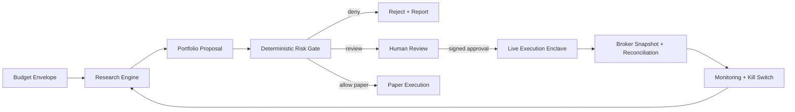

# Lincei Autonomous Investment Control Plane

## Goal

Build an autonomous investment system that can turn a budget into researched, risk-checked, monitored investment actions. The system should eventually support:

1. research ideas from market data, news, filings, and user goals;
2. produce reproducible signals and portfolio proposals;
3. run deterministic risk checks before any execution;
4. execute only through a small broker adapter that has no LLM access;
5. monitor holdings, errors, drawdown, and recovery rules after execution.

The target user goal is aggressive asset growth, but the engineering goal is not "let an AI trade freely." The system must be able to say no, reduce exposure, or stop trading when the evidence or risk state is weak.

## Current State

The repository is currently a NestJS + React investment report application:

- Backend: scheduled news collection, LLM-assisted analysis, SQLite reports.
- Frontend: report and testing dashboard.
- No broker adapter exists.
- No paper-trading or live-trading execution path exists.
- No real-money workflow is executable from this repo today.

This PR starts the next shape by adding a deterministic backend risk gate and the specification for the larger control plane.

## Non-Goals

These are not in the initial scope:

- unrestricted live trading;
- LLM output directly placing orders;
- leverage, margin, shorting, options, futures, HFT, or crypto derivatives;
- broker credentials inside research prompts, reports, or frontend state;
- copying architecture blindly from reference projects;
- hiding failed experiments or only keeping winning backtests.

## System Shape

## Core Components

### 1. Budget Envelope

The user should define a budget envelope before automation begins.

It must include:

- cash budget;
- allowed markets and assets;
- max single position size;
- max gross exposure;
- daily loss limit;
- drawdown limit;
- rebalance frequency;
- whether paper mode, broker read-only mode, or live mode is allowed.

The budget envelope is not a suggestion. It is the hard policy boundary for later agents.

### 2. Research Engine

The research engine should generate proposals, not orders.

Inputs:

- market data;
- news and event extraction;
- filings and macro context;
- benchmark and sector data;
- user budget envelope.

Outputs:

- hypothesis;
- feature and signal definitions;
- timestamped data lineage;
- backtest or simulation result;
- transaction cost assumption;
- proposal with target positions;
- reasons why the proposal can fail.

LLMs may summarize, classify, and propose hypotheses. LLMs must not be treated as validated alpha.

### 2.1 Research Run Ledger

Every autonomous cycle must create a research run before it creates a proposal.

A research run stores:

- objective and budget envelope id;
- status, phase, blocked reasons, and advance eligibility;
- strategy family and hypothesis;
- dataset ids, windows, and availability timestamps;
- feature list and timestamp lag rules;
- no-lookahead check result;
- benchmark;
- transaction cost and slippage assumptions;
- model or baseline name and model category;
- training window if a model was trained;
- validation window;
- backtest metrics;
- artifact refs and hashes;
- known failure modes.

Only a research run with `status: proposal_ready` and `advanceEligible: true` can create a proposal. Blocked research runs must remain visible with their reasons.

The first automated research slice is `POST /control-plane/research-runs/run-baseline`. It runs a deterministic momentum baseline, computes benchmark-aware backtest metrics, hashes the artifact snapshot, and stores a proposal-ready research run when all provenance gates pass. By default it uses local sample bars for manual dry-run research only; when `datasetId`, `symbol`, and `benchmark` are provided it uses imported, timestamp-aligned market bars from the durable market-data ledger. Scheduled paper automation must use pinned imported market bars and must not rely on built-in sample bars. It is a bootstrap runner, not validated alpha.

The first external data slice is the disabled-by-default market-data ingestion worker. `GET /control-plane/market-data/ingestion/status`, `POST /control-plane/market-data/ingestion/poll`, and `GET /control-plane/market-data/ingestion-runs` expose a provider-neutral ingestion loop backed initially by Stooq daily CSV bars. Each poll writes only `market_data_bars` and `market_data_ingestion_runs`, records provider/source/request-hash evidence, imports configured symbols plus benchmark, and hard-sets broker/live execution flags to `false`. The dashboard must show this worker beside the current autonomous cycle so paper schedules can be tied back to actual imported data freshness.

Model training is optional, not the default. The first implementation should use deterministic baselines and simple factor/ranking strategies. A trained model can be introduced only when it produces a signal that is evaluated like any other proposal.

Allowed first model categories:

- ranking models for risk-adjusted return or benchmark outperformance probability;
- regime classifiers for volatility/trend/risk-off states;
- event classifiers for news and filing events;
- slippage or execution-cost estimators.

Disallowed first model categories:

- LLM direct buy/sell model;
- reinforcement-learning allocator;
- model output directly mapped to broker orders;
- backtest-selected parameter set presented as validated alpha.

### 3. Portfolio Proposal

A proposal is a typed object that can be tested and rejected.

It should include:

- research run id;
- strategy id and version;
- rule id or deterministic provenance;
- generated timestamp;
- market data timestamp;
- target asset list;
- target weights or order intents;
- expected turnover;
- benchmark;
- drawdown and scenario notes;
- whether human approval is required.

### 4. Risk Gate

The risk gate is deterministic. It should not call an LLM and should not call a broker.

The first backend slice is `POST /risk-gate/evaluate`. It returns:

- `ALLOW`;
- `REVIEW`;
- `DENY`;
- reasons;
- policy snapshot;
- `brokerExecutionEnabled: false`.

The control-plane slice also provides `POST /control-plane/proposals/:id/evaluate-risk`, which stores every evaluation. A result is not accepted unless the request and response snapshots are durable.

Minimum checks:

- reject control-plane proposals that do not link to a persisted research run;
- reject control-plane proposals when the linked research run is not proposal-ready;
- reject live mode in this repo until a separate live gate is implemented;
- reject broker credentials or broker account ids in evaluation requests;
- reject any execution intent other than `evaluate_only`;
- reject stale or future-dated market data;
- reject LLM-only proposals without strategy and rule provenance;
- reject shorting, leverage, derivatives, crypto derivatives, and unknown assets;
- reject orders over max notional;
- reject single-position concentration;
- reject gross exposure above policy;
- reject daily loss and drawdown breaches;
- mark paper or live-adjacent actions for human review unless explicitly approved.
- keep `allowPaperAutoApproval` disabled by default; when enabled, it is only an input to schedule-scoped paper authorization and never enables broker or live execution.

### 5. Execution Enclave

Execution must be a separate module or service with a narrow API.

Rules:

- no LLM import;
- no research module import;
- no prompt text;
- no arbitrary generated code;
- only signed approved order plans;
- broker credentials only in the execution environment;
- every order has idempotency keys, dry-run support, and audit logs;
- every fill is reconciled against broker snapshots.

Initial execution should be paper only. Live mode requires a separate design review.

Current paper slice:

- `paper_order_plans` records deterministic paper-only order plans;
- paper execution is derived from a stored proposal, never an arbitrary request body;
- each plan stores proposal/risk/plan hashes, an idempotency key, readiness snapshot, immutable paper order ids, fill events, cash ledger rows, position ledger rows, portfolio before/after snapshots, reconciliation state, and kill-switch snapshot;
- `paper_accounts` stores the current durable paper account projection for paper cash, equity, gross exposure, positions, applied plan ids, and account-level cash/position ledgers across cycles;
- `paper_account_events` stores append-only seed, promotion, and paper-plan account events with per-account sequence, request hash, event hash, and previous-event hash;
- `autonomous_run_schedules` can store a standing paper-only authorization, but only when the schedule is `paper`, the budget is `paper`, `attemptPaperExecution` is on, the active budget policy explicitly sets `allowPaperAutoApproval: true`, the schedule pins `researchDatasetId`, `researchSymbol`, and `researchBenchmark` to imported market bars, optional `researchMaxDataAgeMinutes` freshness passes, and the schedule's stored budget-policy hash still matches at execution time;
- paper schedules fail closed without pinned imported market data; schedule-created proposals derive `marketDataTimestamp` from the imported dataset availability timestamp, not from wall-clock proposal time;
- when execution control is `reducing`, the same standing paper schedule authorization may auto-approve only deterministic SELL-only paper recovery proposals whose research run is based on the internal paper-account projection; BUY proposals, broker/live proposals, and non-recovery rules remain blocked;
- automatically created paper approvals are still durable `order_plan_approvals` records with local hash-signature custody, current paper-account event binding, consumed-plan evidence, `approvalSource: paper_auto` or `recovery_auto`, run/schedule provenance, and `brokerExecutionEnabled/liveTradingEnabled: false`;
- paper-mode risk evaluation and paper execution require an explicitly seeded and promoted active paper account;
- `order_plan_approvals` stores durable signed paper approvals with approver, reason, proposal hash, risk request hash, approval hash, idempotency key, status, expiry, and consumed plan id;
- paper approvals are locally signed over a canonical payload that includes proposal, risk, idempotency, approver, expiry, paper account id, latest paper account event hash/sequence, signer key ref, and approval custody mode;
- approval creation requires the caller to provide `expectedPaperAccountEventHash`, and creation fails if the paper account event chain has advanced;
- `POST /control-plane/proposals/:id/paper-execute` returns the same plan for the same idempotency key and has a database uniqueness guard for the proposal/idempotency pair;
- paper execution requires an active order-plan approval that matches the proposal, paper-mode risk evaluation, and idempotency key;
- paper execution checks approval payload hash/signature evidence, binds the approval to the current promoted paper account, blocks stale paper account event hashes, records the paper account lock version, and rechecks the event chain and lock version immediately before applying simulated fills to the durable paper account;
- the final paper apply commit runs inside a database transaction when `DataSource` is available, atomically claims the next paper-account lock version before account mutation, and covers plan state, reservation hold consumption/release, paper account projection, paper account event append, approval consumption, and proposal audit update; if the account-event append, lock claim, or any commit step fails, the plan is blocked and the reservation hold is released instead of leaving a partially applied account;
- `POST /control-plane/paper-account/seed`, `POST /control-plane/paper-account/:id/promote`, and `GET /control-plane/paper-account/events` expose the explicit account lifecycle and append-only paper account event chain;
- `GET /control-plane/paper-account` exposes only an active promoted paper account;
- `POST /control-plane/paper-order-plans/:id/reconcile` reconciles expected paper cash and positions against account ledger entries for that plan;
- `GET/POST /control-plane/execution-control` stores a minimal execution-control state (`active`, `paused`, `reducing`, `halted`) and paper execution blocks when the state forbids new exposure;
- `GET /control-plane/kill-switch/status` and `POST /control-plane/kill-switch/trip` expose a durable runtime stop that halts autonomous advancement and paper execution without consuming schedule cycles;
- `GET /control-plane/action-timeline` exposes a unified operator audit feed across control, schedule, market-data, research, proposal, risk, approval, paper, and broker evidence so the dashboard can show what the autonomous system did and why it stopped;
- broker and live execution flags remain `false`.

This is a paper simulator ledger, not broker-grade execution readiness. Broker-grade paper readiness still requires production-grade signing custody, explicit database migrations and deployment policy for the lock columns/indexes, scheduled broker read-only polling, broker-order emergency cancel/flatten controls, and reconciliation against external account truth.

### 6. Broker Adapter

The first broker candidate is Toss Securities Open API because the official pages now expose Open API guidance. The current repo should treat Toss as a future adapter, not as an implemented execution path.

Adapter boundary:

- auth token client;
- accounts and holdings snapshot;
- market data client;
- order preview where available;
- order placement only after signed control-plane approval;
- cancel and reconciliation;
- rate limit and retry rules.

No adapter should expose raw broker credentials to the frontend or LLM layer.

Current read-only slice:

- `broker_snapshots` stores imported read-only account evidence with provider, source ref, hashed account ref, timestamp, cash, equity, exposure, positions, reconciliation status, and hard `brokerExecutionEnabled/liveTradingEnabled: false` flags;
- `POST /control-plane/broker-snapshots/import-read-only` accepts manual/imported snapshots and rejects broker credentials, account ids, tokens, order payloads, and order intent fields;
- `GET /control-plane/broker-snapshots` and `GET /control-plane/broker-snapshots/latest` expose read-only snapshot history;
- `POST /control-plane/broker-snapshots/:id/reconcile-paper` compares a broker snapshot with the active paper account and records cash, equity, position, tolerance, age, stale, match, or mismatch evidence;
- `broker_fills` stores imported read-only fill evidence with hashed account/order/fill refs, symbol, side, quantity, price, notional, fee, timestamp, reconciliation status, and hard `brokerExecutionEnabled/liveTradingEnabled: false` flags;
- `POST /control-plane/broker-fills/import-read-only` and `GET /control-plane/broker-fills` expose the fill evidence ledger without accepting credentials, order payloads, or callable order intent;
- `GET /control-plane/broker-adapter/status` exposes a provider-neutral Toss readiness contract for credential presence, credential custody, OpenAPI schema verification, sandbox verification, read-only enablement, blocked order capabilities, and broker emergency-control blockers without exposing secrets;
- the dashboard shows a Broker Snapshot Monitor next to paper execution so the user can see whether external account truth matches internal paper state;
- this is not a Toss client yet and cannot call Toss, place, cancel, modify, preview, or route orders.

Toss Securities API must be treated as real-money write access unless an official sandbox or paper environment is verified. Official public pages show OAuth client-credentials, account lookup, holdings, and order examples, but access requires a Toss Securities account, pre-application, and API key issuance. The current public docs do not prove a paper environment.

### 7. Monitoring and Recovery

The system must monitor:

- broker connectivity;
- order state;
- partial fills;
- duplicate order risk;
- holdings mismatch;
- daily PnL;
- drawdown;
- stale data;
- missing benchmark;
- strategy drift;
- unexpected cash usage.

Recovery means a deterministic stop, reduce, or liquidate workflow. It does not mean asking an LLM to "make the money back."

Current recovery implementation:

- `POST /control-plane/recovery/run-baseline` reads the active promoted paper account or an explicit `paperAccountId`;
- it creates a `paper_recovery` research run, a linked `paper-account-recovery-sell-only-v1` proposal, and a persisted risk evaluation;
- proposal orders are `SELL` only, sorted from largest paper position first, and capped by the active budget `maxOrderNotional`;
- the risk gate allows reducing SELL orders even when the current long position is already above the single-position limit, while still denying oversized or non-reducing SELL attempts;
- recovery proposal generation computes a deterministic `paper-recovery-state:*` evidence ref from the paper-account projection, budget, max position count, and max order notional, then replays the existing research run/proposal/risk evaluation for duplicate requests;
- the dashboard exposes this as "Create sell-only recovery", clearly separate from paper execution;
- autonomous run advancement also enters this SELL-only recovery path when execution control is `reducing`, so scheduled automation stops generating new BUY proposals and instead creates a recovery research run/proposal/risk evaluation from active paper positions;
- recovery proposal generation never submits paper fills, never creates signed approval, never calls broker APIs, and keeps all broker/live flags disabled.

## Reference Projects Policy

Reference projects live under `references/projects/` and are intentionally git-ignored. They are used for inspection only.

Important rule: reference does not mean copy. We should study proven patterns, then choose the smallest design that fits this project.

Reference use:

- Lean / QuantConnect: backtest engine shape, algorithm lifecycle, data normalization, result reporting.
- Lean CLI: local/cloud workflow shape and command boundaries.
- NautilusTrader: event-driven execution architecture and adapters.
- Alpaca-py: small broker SDK boundary ideas.
- Freqtrade: dry-run mode, protections, config validation, operational safety gates.
- Hummingbot: connector separation and kill-switch style controls.
- Qlib / vectorbt: research sweeps and reproducible experiment patterns.
- Zipline / Backtrader / bt: baseline portfolio and backtest interfaces.
- FinRL: research reference only; reinforcement learning is not an initial allocator.

When adopting a reference pattern, cite the inspected file or function in the design note and re-express the behavior in Lincei terms. Similar role names are acceptable, but behavior must be implemented from this project's requirements and covered by local tests.

High-value patterns to adapt:

- explicit run lifecycle, config, output, and shutdown handling;
- handler and adapter boundaries rather than strategy-owned infrastructure;
- hard environment separation between research, backtest, paper, sandbox, and live;
- staged flow from signal to portfolio target to risk to execution;
- pre-execution risk checks;
- control states such as `idle`, `running`, `paused`, `halted`, `stopping`;
- no-lookahead timestamp handling;
- durable experiment and proposal ledgers.

Patterns to avoid:

- live broker account sync before read-only and paper gates exist;
- direct order, force-entry, force-exit, or liquidation controls in app code;
- crypto bot runtime assumptions as the default product model;
- treating vectorized simulations as broker execution behavior;
- heavy experiment infrastructure before a small local ledger exists;
- stringly config mutation when typed contracts are practical.

## Initial Implementation Plan

### Phase 0: Safe Control Plane Start

Deliverables:

- tracked `SPEC.md`;
- ignored `references/projects/` with a tracked README;
- reference register with clone URLs and current commits;
- Toss Open API readiness note;
- backend risk gate module;
- unit tests for deterministic denial/review rules.

Exit criteria:

- backend tests pass;
- backend builds;
- reference clones are git-ignored;
- no broker order path exists.

### Phase 1: Proposal Contracts

Add durable proposal schemas and storage:

- budget envelope entity;
- research run entity;
- proposal entity;
- risk gate evaluation entity;
- audit log;
- report link from proposal to research evidence.

Exit criteria:

- every proposal has data timestamps and provenance;
- no proposal can be evaluated without policy;
- every rejection is stored.

Current status:

- budget envelope entity exists;
- research run entity exists;
- proposal entity exists;
- risk evaluation entity exists;
- autonomous run entity exists;
- proposals require a research run id;
- proposal creation is blocked unless the research run is proposal-ready;
- deterministic baseline runner creates proposal-ready research runs from a budget or initial capital;
- control-plane status and list/create/evaluate endpoints exist;
- broker execution remains disabled.

### Phase 2: Research Automation

Add automated research runs:

- market/news ingestion schedule;
- strategy hypothesis generator;
- backtest runner;
- benchmark comparison;
- transaction cost and slippage assumptions;
- report generation for passed and failed runs.

Current status:

- built-in deterministic baseline backtest runner exists;
- durable `market_data_bars` ledger and import/list API exist for timestamped OHLCV research evidence;
- baseline runner can use imported asset and benchmark bars by pinned `datasetId`, `symbol`, and `benchmark`;
- runner computes benchmark comparison, costs, slippage, turnover, drawdown, Sharpe, Sortino, Calmar, information ratio, fees, win rate, and artifact hash;
- external provider clients and scheduled market/news ingestion are still missing.

Backtesting minimums:

- baseline comparison;
- transaction costs;
- slippage;
- turnover;
- exposure;
- concentration;
- drawdown;
- Sharpe, Sortino, Calmar where applicable;
- train/validation/test split when model training is used;
- no-lookahead timestamp checks;
- out-of-sample result recorded before a proposal can advance.

Exit criteria:

- failed experiments are visible;
- no-lookahead and timestamp alignment tests exist;
- reports include costs, turnover, concentration, drawdown, and benchmark.

### Phase 3: Paper Execution

Add paper execution enclave:

- signed order plan format;
- paper broker adapter;
- reconciliation loop;
- kill switch;
- frontend review surface.

Exit criteria:

- paper orders can run end to end;
- duplicate order protection exists;
- kill switch is tested;
- no real broker credentials are required.

Current status:

- deterministic paper order-plan ledger exists;
- durable signed paper order-plan approval ledger exists;
- idempotent paper-execute endpoint exists;
- idempotent SELL-only recovery proposal replay exists for unchanged paper-account projections;
- autonomous runs in `reducing` execution-control state generate SELL-only recovery proposals instead of fresh BUY allocation proposals;
- paper fill, cash ledger, position ledger, and local reconciliation snapshots exist;
- paper position accounting now records quantity, average price, cost basis, unrealized PnL, and realized PnL in simulated fills, position ledger entries, account positions, and dashboard position rows;
- paper execution readiness now records reservation evidence for required cash, reserved cash, available cash, required sells, reserved sells, and available sell notional by symbol before fill simulation;
- filled paper order plans now persist a durable reservation-hold snapshot with hold id, status, cash amount, sell notional by symbol, hold hash, approval-custody-at-hold evidence, account event hash/sequence at hold, and consumption timestamp;
- if the paper account event chain advances after readiness checks but before account apply, the plan is blocked, simulated fills/ledgers are cleared, and the reservation hold is released instead of consuming the approval;
- readiness checks subtract any still-reserved paper hold snapshot even if a previous plan has already moved out of an open execution status;
- paper reservation holds now persist to a dedicated `paper_reservation_holds` database ledger before fill simulation, and readiness checks subtract `reserved` rows before falling back to legacy plan snapshots;
- durable paper account state now carries simulated cash, equity, exposure, positions, and applied plan ids across paper cycles;
- minimal execution-control state and halted/paused/reducing gate exists;
- runtime kill switch now exposes a durable dashboard/API stop that halts autonomous advancement and schedule consumption, but it does not cancel or flatten broker orders;
- control-plane status now exposes an explicit disabled live-trading gate with blockers for order endpoints, broker write access, credential custody, fill polling, reconciliation, and broker-order emergency controls;
- control-plane status now exposes a top-level action summary that ties latest autonomous run, paper evidence, broker snapshot/fill evidence, current blocker, and next safe action together;
- frontend dashboard shows paper account state, execution-control state, latest paper plans, fills, reconciliation notes, hashes, the top-level action summary, and broker/live disabled guardrails;
- still missing production signing custody, explicit migrations/deployment policy for the database lock schema, and scheduled broker-backed reconciliation.

### Phase 4: Broker Read-Only

Add broker read-only mode:

- Toss or another broker account snapshot;
- holdings import;
- cash import;
- reconciliation against internal paper state.

Current status:

- broker snapshot entity and read-only import API exist;
- raw account refs are hashed and credentials/order fields are rejected;
- broker snapshots can be reconciled against the active paper account for cash, equity, positions, tolerance, and staleness;
- provider-neutral Toss adapter readiness contract reports credential/schema/fill-schema/sandbox/read-only/order-placement gates;
- disabled-by-default Toss read-only poll workers exist and only allowlist token, account, holdings, and an operator-configured GET fill path before importing mapped snapshots/fills through the same broker ledgers;
- imported Toss read-only snapshots attempt automatic reconciliation against the active paper account and report the latest reconciliation status on the adapter poll status;
- read-only broker fill evidence can now be manually imported or polled through the configured read-only fill path into `broker_fills` and matched against paper fills;
- frontend dashboard shows latest broker snapshot status, broker fill evidence, fill-poll readiness, paper-fill match details, Toss readiness gates, reconciliation notes, and top-level broker truth in the action summary;
- still missing verified Toss schema responses, production credential custody, provider-specific rate-limit/error handling, order custody, and broker write controls.

Exit criteria:

- broker API credentials stay outside LLM/frontend state;
- no order endpoint is callable;
- stale snapshots are detected.

### Phase 5: Tiny Live Pilot

Only after a separate design review:

- one broker adapter;
- tiny budget cap;
- long-only liquid stocks or ETFs;
- explicit human approval;
- immediate broker-order cancel/flatten kill switch;
- daily reconciliation;
- rollback plan.

Exit criteria:

- broker terms are reviewed;
- account permissions are understood;
- live order path has integration tests and dry-run parity;
- maximum loss is bounded before the first order.

## Real-Money Readiness

Current verdict: not ready.

The system is not ready for "deposit money and let it invest." After this PR it can import timestamped market bars, create reproducible baseline research runs from sample or pinned imported datasets, advance an autonomous run through budget-bound research, proposal generation, and risk evaluation, run an env-gated in-process worker that ticks atomically leased run schedules, and simulate approved or schedule-auto-approved paper order plans against a durable local paper account with ledger/reconciliation evidence. Paper schedules are dataset-bound and freshness-gated, so stale or sample-only scheduled automation is blocked before approval/execution. When execution control is `reducing`, a standing paper schedule can also auto-approve and paper-execute deterministic SELL-only recovery proposals from current paper-account positions. It still cannot allocate, execute, or recover real capital end to end.

Blocking items:

- Toss API access and API key approval;
- exact OpenAPI schema review;
- verified Toss broker adapter implementation beyond the current readiness contract;
- production signing custody for human approvals;
- verified broker-backed reconciliation with real Toss schema/client responses;
- explicit paper account seed/promote workflow exists, but production custody and operator policy still need hardening;
- schedule leases and an env-gated in-process worker for autonomous runs exist with due/not-due checks, TTL validation, owner-checked release, overlap guard, and cycle keys; distributed DB lock audit, scheduler deployment policy, and auth boundary still need hardening;
- production migration/deployment policy for paper-account lock columns and reservation indexes;
- operational monitoring;
- legal and terms review;
- explicit live-trading gate.
