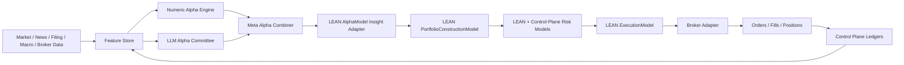

# Lincei Autonomous Alpha System

## Goal

Build a personal, aggressive autonomous investment system that combines:

1. LEAN / QuantConnect as the executable strategy, backtest, paper, and live-trading engine;
2. LLM agents as first-class alpha judges for research, event interpretation, strategy review, and model selection;
3. deterministic portfolio, risk, execution, broker, and ledger boundaries so capital can move only through typed, testable contracts.

The project is not a generic investment-report dashboard. The core product is an automated capital-allocation system. Dashboards, reports, and ledgers exist to make the engine observable and controllable, not to replace the engine.

## Current Reality

The repository already has useful control-plane foundations:

- budget envelopes;
- deterministic risk gate;
- research-run and proposal ledgers;
- market-data bar import and ingestion records;
- paper account, paper order plan, approval, reservation, and reconciliation ledgers;
- execution-control and kill-switch state;
- broker read-only evidence, broker order lifecycle evidence, and broker command dry-run ledgers;
- React operational dashboard.

The critical missing piece is the actual investment execution brain:

- no LEAN workspace is integrated as a first-class runtime;
- no QuantConnect MCP/API or Lean CLI orchestration is implemented;
- no production `AlphaModel`, `PortfolioConstructionModel`, `RiskManagementModel`, or `ExecutionModel` exists;
- no LLM alpha committee produces typed decisions for LEAN;
- no meta-alpha layer converts numeric and LLM judgments into executable `Insight` objects;
- no broker write adapter can submit, cancel, or reconcile real orders.

The old deterministic momentum baseline remains useful only as a smoke-test fallback. It is not the product.

## Design Principle

Move in vertical slices that prove the capital-allocation loop works end to end:

```text
Data -> Numeric Features -> LLM Alpha Committee -> Meta Alpha
     -> LEAN Insight -> Portfolio Targets -> Risk Cuts
     -> Paper/Live Execution -> Broker Reconciliation -> Learning Loop
```

Do not spend large effort on secondary surfaces until the execution engine, alpha model, portfolio sizing, and risk/execution loop are working.

## System Shape



## Documentation Map

Detailed implementation guidance is split across focused documents:

- [V1 Autonomous Live Pilot Working Spec](docs/v1-live-pilot-spec/README.md): current dated implementation spec for the all-at-once LEAN + OpenAI alpha + paper execution + 10 USD live-pilot build. Implementation agents must read the linked sub-documents before editing code.
- [Project Architecture](docs/project-architecture.md): target architecture, module ownership, and data flow.
- [LEAN and QuantConnect Engine](docs/lean-quantconnect-engine.md): how LEAN, Lean CLI, and QuantConnect MCP fit into this repo.
- [Alpha Model Design](docs/alpha-model-design.md): numeric alpha, LLM alpha, meta alpha, outputs, and validation.
- [LLM Alpha Committee](docs/llm-alpha-committee.md): agent roles, schemas, guardrails, and where LLM judgment is allowed.
- [Latency and Execution Paths](docs/latency-and-execution-paths.md): fast path, slow path, expected latency, and strategy suitability.
- [Model Training Plan](docs/model-training-plan.md): training targets, datasets, validation, and hardware plans for T4 16GB, RTX 3070 8GB, and TPU v5e.
- [Implementation Roadmap](docs/implementation-roadmap.md): concrete build phases and acceptance criteria.
- [Research References](docs/research-references.md): papers, official docs, and how to use them without copying blindly.

Existing operational docs remain useful but should be updated as implementation catches up:

- [API Reference](docs/api-reference.md)
- [Execution Readiness](docs/execution-readiness.md)
- [Toss Open API Readiness](docs/toss-open-api-readiness.md)
- [Development Guide](docs/development-guide.md)
- [Deployment Guide](docs/deployment-guide.md)

## Core Contracts

### Alpha Decision

Every alpha source must produce typed output, not free-form trade text:

```ts
type AlphaDecision = {
  symbol: string;
  asOf: string;
  horizonDays: number;
  direction: "up" | "down" | "flat";
  expectedReturnBps?: number;
  confidence: number;
  conviction: "low" | "medium" | "high";
  maxPositionPct?: number;
  stopLossPct?: number;
  takeProfitPct?: number;
  sourceModels: string[];
  evidenceRefs: string[];
  thesis?: string;
  counterThesis?: string;
  abstainReason?: string;
};
```

LEAN converts this into `Insight` fields:

- `symbol` -> `Insight.Symbol`;
- `direction` -> `InsightDirection`;
- `horizonDays` -> `Insight.Period`;
- `expectedReturnBps` -> `Insight.Magnitude`;
- `confidence` -> `Insight.Confidence`;
- `maxPositionPct` -> optional `Insight.Weight`.

### Portfolio Target

Portfolio construction should size capital with deterministic math:

- top-k concentration for aggressive growth;
- volatility targeting;
- fractional Kelly caps when edge estimates are calibrated;
- liquidity and turnover limits;
- max symbol, sector, market, and gross exposure caps.

LLMs may recommend conviction and risk concerns. They must not directly decide final order quantity.

### Execution Boundary

Execution code must not import LLM modules or prompt text. It receives approved portfolio targets or signed order plans and produces idempotent paper/live orders through a broker adapter.

## Required Engine Modes

### Fast Path

Purpose: low-latency actions where LLM reasoning would be too slow.

- LEAN numeric alpha only;
- no LLM call;
- no fresh strategy generation;
- used for stop-loss, risk-off, de-risking, breakout continuation, and validated rule execution;
- expected latency: seconds.

### Slow Path

Purpose: high-context decisions.

- numeric factors plus LLM alpha committee;
- news, filings, macro, portfolio context, and bull/bear debate;
- optional Lean backtest or scenario check before new exposure;
- used for new positions, concentration increases, strategy selection, and event-driven trades;
- expected latency: one to several minutes.

### Research Path

Purpose: strategy creation, retraining, walk-forward validation, and promotion.

- full data pull;
- training or parameter search when needed;
- Lean backtests and reports;
- LLM review and failure analysis;
- expected latency: minutes to hours.

## Model Strategy

The first production-shaped system should include all major layers even if early models are simple:

1. numeric alpha engine: momentum, trend, volatility, liquidity, and cross-sectional rank features;
2. LLM alpha committee: structured analysis of news, filings, macro, and current portfolio state;
3. meta-alpha combiner: deterministic and trainable combination of numeric and LLM decisions;
4. LEAN AlphaModel adapter: emits `Insight` objects;
5. LEAN PortfolioConstructionModel: aggressive top-k sizing with volatility and Kelly-style caps;
6. LEAN RiskManagementModel plus control-plane risk gate;
7. LEAN ExecutionModel plus broker adapter.

## Implementation Priority

1. Create a real LEAN workspace and first algorithm: `aggressive_llm_momentum`.
2. Add local `lean backtest` orchestration and result ingestion.
3. Implement numeric feature snapshots and AlphaDecision storage.
4. Implement LLM Alpha Committee schemas and prompts.
5. Implement meta-alpha to LEAN `Insight` adapter.
6. Implement aggressive portfolio construction and risk cuts.
7. Connect paper execution and dashboard to LEAN outputs.
8. Add training pipeline and model registry.
9. Add broker write adapter only after paper/live-shadow validation.

## Non-Goals

- HFT, market making, or tick scalping;
- LLM free-text directly placing broker orders;
- hidden backtest selection or only storing winning runs;
- unrestricted leverage, margin, options, futures, or derivatives before a separate design review;
- broker credentials in frontend, LLM prompts, or research artifacts;
- UI polish that delays the alpha/execution loop.

## Real-Money Readiness

Current verdict: not ready.

The repo has control-plane foundations, but the executable investment engine is still missing. Real-money readiness requires at minimum:

- LEAN algorithm backtests ingested into the control plane;
- paper/live-shadow performance evidence;
- stable alpha decision schemas;
- latency monitoring for fast and slow paths;
- broker write adapter with cancel/flatten controls;
- fill and open-order reconciliation;
- production credential custody;
- explicit user loss limits and kill-switch drills.
