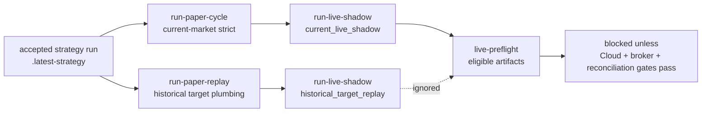

# LEAN Backtest And Readiness Paths

Status: operator runbook. The active scope is defined by [../SPEC.md](../SPEC.md).

This document separates **what each path proves**. QuantConnect Cloud backtests are the preferred promotion evidence when account access allows them. Local historical LEAN runs can support strategy validation artifacts when data quality passes. The local simulator and flow-validation paths prove artifact plumbing only.

## Path overview

| Path                                         | Command / trigger                                                           | What it validates                                                                                                                                | Live-ready?                                                            |
| -------------------------------------------- | --------------------------------------------------------------------------- | ------------------------------------------------------------------------------------------------------------------------------------------------ | ---------------------------------------------------------------------- |
| **LEAN flow validation**                     | `lean-backtest` with `LEAN_ALLOW_SIMULATOR=true`, or simulator fallback     | End-to-end artifact export, import, paper bridge wiring                                                                                          | No                                                                     |
| **Historical numeric backtest**              | `run-full-backtest` / `LeanCliRunner`                                       | Bar-by-bar numeric alpha inside LEAN on local historical data                                                                                    | Debug/supporting evidence when local data gates pass                   |
| **Rolling ML / meta research**               | `run-alpha-cycle`, external baselines, `LIVE_PREFLIGHT_ALLOW_RESEARCH=true` | Nest feature snapshots, LightGBM scores, LLM committee, static `meta_decisions.json`                                                             | No (research only)                                                     |
| **QuantConnect Cloud artifacts**             | `qc-cloud-backtest`, `qc-object-store-sync`                                 | Cloud project push/backtest attempt, Object Store feature artifact upload, account-tier blockers, REST result import, imported-result acceptance | Promotion evidence only when cloud artifacts are imported and accepted |
| **Paper trading / shadow trading artifacts** | `run-paper-cycle`, `run-paper-replay`, `run-live-shadow`, `live-preflight`  | Policy gates, historical replay plumbing, would-have-traded artifact, broker snapshot reconciliation, blocked pre-trade risk check artifacts     | No real broker writes under active spec                                |

**Static LLM / meta overlay is not historical alpha validation.** `meta_decisions.json` is a single committee snapshot per run (QuantConnect “precomputed overlay” pattern). It does not walk forward through time and must not be treated as proof that LLM alpha worked historically.

---

## LEAN flow validation (plumbing only)

Use when Docker/Lean CLI or QC data is unavailable (CI, local smoke).

```bash
export LEAN_ALLOW_SIMULATOR=true
./scripts/lean-backtest
./scripts/import-lean-run latest
```

Artifacts include `config.json` with `"simulator": "lean-local-simulator-v1"`. **Live-preflight legacy check blocks** simulator runs, `validationMode: flow-validation`, and `usesStaticMetaOverlay: true` unless `LIVE_PREFLIGHT_ALLOW_RESEARCH=true` or `parameters.mode: research`.

---

## Historical numeric backtest (local debug/supporting evidence)

### What runs inside LEAN

| Layer                            | Where                                              | Data                                              |
| -------------------------------- | -------------------------------------------------- | ------------------------------------------------- |
| **Numeric alpha**                | `LinceiNumericAlphaModel`                          | QC historical US equity bars                      |
| **Meta overlay (optional)**      | `input/meta_decisions.json` from `run-alpha-cycle` | Static snapshot — not walk-forward LLM validation |
| **External ML file (optional)**  | `input/ml_predictions.json`                        | LightGBM scores when present                      |
| **Portfolio / risk / execution** | Algorithm Framework                                | Same bar stream                                   |
| **Artifacts**                    | `artifacts/lean-runs/<runId>/`                     | Imported via `import-lean-run`                    |

Numeric features are computed **bar-by-bar inside LEAN** (200+ day warm-up). Nest `market_data_bars` (Stooq ingest) feeds **ML alpha in Nest only**, not the LEAN engine bar stream.

Default local no-download window: **2020-01-01 → 2021-03-31** daily for bundled/local smoke data. Full quality-gated universe validation should run in QuantConnect Cloud first to avoid local QCC data-download charges.

### One-time setup

#### Bun (required)

This repo uses **Bun** for Node/TypeScript apps (**not npm**). Install [Bun](https://bun.sh), then:

```bash
cd backend && bun install
cd ../frontend && bun install
```

Pre-PR quality gate:

```bash
cd backend && bun install && bun run lint && bun run test:all && bun run build
cd ../frontend && bun install && bun run lint && bun run test:run && bun run build
```

Validation commands always go through `bun run v1:cli -- <command>` from `backend/` or the `./scripts/*` wrappers.

#### Repo (automated)

```bash
./scripts/setup-ml-venv.sh
./scripts/download-external-baselines
./scripts/setup-lean-cli.sh
chmod +x scripts/*.sh
```

#### Docker

Install [Docker Desktop](https://www.docker.com/products/docker-desktop/) and verify `docker info`.

On Linux ARM64, a long-lived shell can miss a new Docker group membership after Docker Engine is installed. The backend checks direct `docker info` first and then falls back to:

```bash
sg docker -c "docker info"
```

If that works, local LEAN commands are run through the same `sg docker` wrapper. Starting a new login shell is still the cleaner long-term fix.

#### QuantConnect workspace

1. Account: https://www.quantconnect.com/signup
2. API token: https://www.quantconnect.com/account
3. `./scripts/setup-lean-workspace.sh` → `engines/lean/lean.json` and `engines/lean/data/`

#### QC local market data (paid, not default)

Local `lean data download` can spend QCC and is disabled by default in repo wrappers. Do not use this path for the full quality universe unless the user explicitly accepts local data costs.

Use QuantConnect Cloud first:

```bash
./scripts/run-cloud-quality-backtest
```

Only after cost approval, local QC downloads require:

```bash
export ALLOW_PAID_QC_LOCAL_DATA_DOWNLOAD=true
export LEAN_DOWNLOAD_DATA=true

cd engines/lean
../../.venv-lean-cli/bin/lean data download --dataset "US Equity Security Master"
../../.venv-lean-cli/bin/lean data download \
  --dataset "US Equities" \
  --data-type Trade \
  --ticker "SMH,NVDA,AVGO,TSM,ASML,AMAT,AMD,MU,LRCX,KLAC,MRVL,IGV,CIBR,MSFT,ORCL,NOW,PANW,CRWD,PLTR,ANET,DDOG,GRID,ETN,PWR,VRT,GEV,CEG,VST,XAR,UFO,RKLB,LMT,NOC,LHX,SPY" \
  --resolution Daily \
  --start 20230101 \
  --end 20251231
```

If QuantConnect `--download-data` fails with a Security Master/map-factor entitlement blocker, do not buy the dataset by default. Use Cloud. `prepare-lean-local-data` remains available for no-charge local coverage checks and Stooq-backed research data when `STOOQ_API_KEY` is already available.

#### Cloud package preflight

Run this before a QuantConnect Cloud push:

```bash
./scripts/verify-lean-cloud-package aggressive_llm_momentum
```

This command proves the local package against the failure class that is most likely to appear only after a manual Web IDE run:

- source Python files compile, excluding generated `backtests/` snapshots;
- focused LEAN tests pass;
- a Docker LEAN backtest boots and completes with `universe-manifest-path` pointing at a deliberately missing file;
- the backtest uses local sample symbols `SPY,QQQ,IWM`, so it does not trigger QuantConnect local data downloads.

`qc-cloud-backtest --push`, `qc-cloud-push`, and `run-cloud-quality-backtest` run this preflight automatically. `SKIP_LEAN_CLOUD_PACKAGE_PREFLIGHT=true` is available only for a documented platform blocker or emergency Cloud-only check.

#### Secrets in `backend/.env`

Copy `backend/.env.example` if needed, then fill:

```bash
QUANTCONNECT_USER_ID=...      # from QC email
QUANTCONNECT_API_TOKEN=...    # from QC email
OPENAI_API_KEY=sk-...         # optional; LLM committee in alpha cycle
```

```bash
./scripts/lean-login-from-env.sh   # writes ~/.lean/credentials
./scripts/setup-lean-workspace.sh  # creates engines/lean/lean.json
```

### Run historical backtest

```bash
./scripts/run-full-backtest.sh --skip-alpha-cycle --skip-market-data-ingest --no-download-data
```

Equivalent:

```bash
cd backend && bun run v1:cli -- run-full-backtest --skip-alpha-cycle --skip-market-data-ingest --no-download-data
```

Does **not** fall back to the local simulator.

Validated local smoke path for Linux ARM64:

```bash
./scripts/run-local-strategy-smoke
```

That wrapper pins the practical local evidence path: skip Nest alpha cycle, skip Stooq ingest, use bundled/local LEAN data only, and run the benchmark override `SPY,QQQ,IWM`. It proves plumbing and local LEAN behavior, not the full quality-gated universe.

---

## Rolling ML / meta research (Nest alpha cycle)

Build the hypothesis registry first when starting from the stored strategy research corpus:

```bash
./scripts/build-hypothesis-registry
```

This converts `references/alphaarchitect/index.json` and `references/alphaarchitect/strategy-register.md` into durable `research_hypotheses` and `research_job_records` rows. It is research backlog evidence, not strategy performance evidence.

Ingest approved text evidence first when the run should include fresh macro text:

```bash
./scripts/ingest-semantic-evidence --source hf-fomc-statements-minutes --limit 80
```

This stores Hugging Face FOMC statements/minutes as `macro` `RawEvidenceRecord` rows with `eventTime`, `publishedAt`, `retrievedAt`, and `availableAt`. These records are inputs to the LLM-derived feature engine; they are not market-price data and do not replace QuantConnect bars.

```bash
./scripts/run-alpha-cycle
# or: cd backend && bun run v1:cli -- run-alpha-cycle
```

Requires ingested bars in SQLite (`datasetId: v1-lean-universe`) **or** test-only synthetic features:

| Variable                        | Purpose                                                                       |
| ------------------------------- | ----------------------------------------------------------------------------- |
| `ALLOW_SYNTHETIC_FEATURES=true` | Allow placeholder features when &lt; 2 bars per symbol (tests/simulator only) |

Local `run-full-backtest` can ingest Stooq bars first; if ingestion fails, alpha may still run only when bars exist. It is a local debugging/supporting path, not production or promotion evidence by itself.

Outputs under `engines/lean/aggressive_llm_momentum/input/`:

- `meta_decisions.json` — static meta/LLM overlay for LEAN
- `llm_event_features.json` — point-in-time LLM-derived features for LEAN replay
- `ml_predictions.json` — optional external LightGBM scores

The same LLM feature payload is exported to `artifacts/llm-features/latest.json` for QuantConnect Object Store upload.

Before treating a backtest as a promotion candidate, run:

```bash
./scripts/run-selected-run-bias-check
```

This must see retained ablation/backtest/Cloud-import variants, including rejected or blocked variants. Exit code `2` is expected until enough variant evidence exists.

---

## QuantConnect Cloud and Object Store

Cloud commands use Lean CLI and always create local evidence records:

```bash
./scripts/qc-cloud-backtest aggressive_llm_momentum --push
./scripts/run-cloud-quality-backtest
./scripts/qc-object-store-sync lincei/llm-features/latest.json
```

Manual Web IDE backtests can be imported directly when the backtest already exists:

```bash
./scripts/list-cloud-projects
./scripts/list-cloud-backtests aggressive_llm_momentum --limit 10

./scripts/import-cloud-backtest \
  --project-id 32097697 \
  --backtest-id ecd033aae81ec9f98e1c24b4c5a58d4c
```

### Backtest result handoff

The preferred handoff to an agent is **not** a screenshot or copied summary
statistics. Provide the QuantConnect `projectId` and `backtestId`, then run the
repo importer above. The importer uses QuantConnect REST endpoints to fetch the
statistics, insights, orders, order events, fills, logs, and portfolio-target
artifacts into `artifacts/lean-runs/<run-id>/`, then imports that evidence into
the local database.

If you cannot find the ids in the Web IDE, use the repo REST wrappers:

```bash
./scripts/list-cloud-projects
./scripts/list-cloud-backtests --project-id 32097697 --limit 10
```

Lean CLI itself can run a cloud backtest and print a results link, but it does
not provide a dedicated command for listing all prior backtest ids. The wrappers
use QuantConnect's `/projects/read` and `/backtests/list` REST endpoints for
that missing lookup step.

If REST import is unavailable, use the Web IDE result page:

1. Open the backtest result in QuantConnect Web IDE.
2. Click **Download Results** on the Overview tab and keep the JSON file.
3. Click **Orders** -> **Download Orders** if order details are needed.
4. Click **Logs** -> **Download Logs** if initialization/runtime diagnostics are
   needed.
5. Give the downloaded files or their local paths to the agent.

For local Lean CLI backtests, the useful handoff is the artifact directory, not
the terminal summary. In this repo that directory is
`artifacts/lean-runs/<run-id>/`; in a raw Lean workspace it is the project's
`backtests/<timestamp>/` folder.

Cloud push wrappers run the Cloud package preflight first. This is intentionally stricter than a normal syntax check because QuantConnect Cloud can compile a project and still fail at `Initialize()` when external input/config files are missing from the Web IDE runtime package.

If credentials, paid organization tier, project lock, or dataset access block the run, the command records a `quantconnect-cloud` LEAN run with `status: blocked` and actionable blocker reasons.

If the Lean CLI cloud command exits successfully, the runner attempts QuantConnect REST import for:

- `/backtests/read` — statistics and status;
- `/backtests/read/insights` — paginated Cloud insights;
- `/backtests/orders/read` — paginated Cloud orders and order events.

The orders endpoint can temporarily return progress/status without an `orders` page. The importer retries each page before treating it as empty, because otherwise a completed Web IDE run can be misclassified as having no fills.

Required env:

| Variable                                     | Purpose                                 |
| -------------------------------------------- | --------------------------------------- |
| `QC_PROJECT_ID` or `QUANTCONNECT_PROJECT_ID` | QuantConnect project id for REST import |
| `QC_USER_ID` or `QUANTCONNECT_USER_ID`       | QuantConnect API user id                |
| `QC_API_TOKEN` or `QUANTCONNECT_API_TOKEN`   | QuantConnect API token                  |

Command success is not promotion evidence by itself. Missing REST credentials, missing project id, incomplete Cloud backtest, zero imported insights/orders/fills, or failed acceptance gates keep the local record `blocked`.

---

## Paper trading / shadow trading artifacts

```bash
./scripts/run-paper-cycle
./scripts/run-paper-replay
./scripts/run-live-shadow
./scripts/live-preflight
```

`run-paper-cycle` is current-market strict. If the latest LEAN target snapshot is historical, the risk gate blocks instead of pretending the target is fresh.

`run-paper-replay` is different: it replays historical targets through paper plumbing and tags the proposal with `paper-replay:historical-target`. Live-preflight legacy check ignores that evidence. Imported QuantConnect Cloud statistics may be strings such as `11.128%` or `$1143.98`; the paper bridge parses those into finite research metrics before proposal creation. Cloud order-derived target weights are cumulative replay artifact, so the paper bridge caps the generated replay orders to the paper budget policy rather than weakening risk gates.



`run-live-shadow` records proposed targets and would-have-traded orders without broker writes. The record has `evidenceMode legacy field`:

- `historical_target_replay` for old LEAN target snapshots;
- `current_live_shadow` only when the target snapshot is current enough for promotion.

`live-preflight` is **fail-closed** and is expected to stay blocked for real broker writes under the active spec. It blocks when:

- Latest LEAN run is simulator / flow-validation / static-meta (unless research mode)
- Broker snapshot `provider === 'simulated'`
- Broker or paper `reconciliation.status !== 'matched'`
- Any required env flag or credential is missing

Research escape hatch (does **not** enable broker writes):

| Variable                                          | Purpose                                                                   |
| ------------------------------------------------- | ------------------------------------------------------------------------- |
| `LIVE_PREFLIGHT_ALLOW_RESEARCH=true`              | Allow flow-validation / static-meta overlay blockers to be waived for dev |
| `parameters.mode: research` in LEAN `config.json` | Same, per-run                                                             |

---

## CLI flags (`bun run v1:cli -- <command>` from `backend/`)

### `run-full-backtest`

| Flag                        | Effect                                                                          |
| --------------------------- | ------------------------------------------------------------------------------- |
| `--skip-alpha-cycle`        | Reuse existing `input/meta_decisions.json`                                      |
| `--no-download-data`        | Do not pass `--download-data` to Lean CLI                                       |
| `--download-data`           | Pass `--download-data`; blocked unless `ALLOW_PAID_QC_LOCAL_DATA_DOWNLOAD=true` |
| `--skip-market-data-ingest` | Skip Stooq → SQLite ingest                                                      |
| `--with-static-meta`        | Enable static `meta_decisions.json` overlay; disabled by default                |
| `--with-static-ml`          | Enable static `ml_predictions.json` overlay; disabled by default                |
| `--no-static-meta`          | Explicitly keep static meta disabled; redundant with current default            |
| `--no-static-ml`            | Explicitly keep static ML disabled; redundant with current default              |

### `lean-backtest`

Uses Lean CLI when `engines/lean/lean.json` exists; with `LEAN_ALLOW_SIMULATOR=true` forces simulator. With `LEAN_STRICT_CLI=false`, failed CLI may fall back to simulator. Simulator fallback is plumbing evidence only.

### `qc-cloud-backtest`

Runs `lean cloud backtest`. `--push` pushes the local project before the cloud backtest. Exit code **2** means account/platform policy blocked the cloud run and a local evidence record was written.

The wrapper applies the same strategy-evidence gates to the local cloud artifact directory. Placeholder artifacts, missing result files, zero insights/orders/fills, simulator markers, static overlays, and missing Cloud REST import evidence keep the run blocked.

### `import-cloud-backtest`

Imports an existing QuantConnect Cloud/Web IDE backtest through REST. This is the preferred no-copy/paste path after a manual Web IDE run:

```bash
./scripts/import-cloud-backtest --project-id <project-id> --backtest-id <backtest-id>
```

The command writes `artifacts/lean-runs/qc-import-<backtest-prefix>/`, updates `.latest`, `.latest-cloud-import`, and `.latest-strategy` when acceptance passes, and persists a `quantconnect-cloud` `LeanRun` record. Exit code **2** means REST credentials, completion status, pagination, or strategy-evidence acceptance blocked the import.

### `run-paper-replay`

Runs the paper execution plumbing against the latest accepted LEAN strategy target while explicitly marking the proposal as historical replay. This command is useful after local or Cloud historical backtests because historical target timestamps are stale by design. It must not be counted as broker-write pre-trade risk check evidence.

### `run-live-shadow`

Creates a shadow trading record from the latest accepted LEAN strategy target snapshot. It never submits broker orders.

### `run-learning-loop`

Creates alpha outcome labels when future market bars are available and records a promotion decision. Labels start from `max(asOf, availableAt)` to avoid training on outcomes before the decision was tradable. Promotion remains `blocked` unless QuantConnect Cloud and `current_live_shadow` evidence are both present.

Exit code **2** = blocked by policy (not a crash).

---

## Environment variables

| Variable                                         | Purpose                                                                           |
| ------------------------------------------------ | --------------------------------------------------------------------------------- |
| `LEAN_CLI_PATH`                                  | Path to `lean` binary (default `.venv-lean-cli/bin/lean`)                         |
| `LEAN_ALLOW_SIMULATOR=true`                      | Force smoke simulator for `lean-backtest`                                         |
| `LEAN_STRICT_CLI=false`                          | Fall back to simulator if CLI fails                                               |
| `LEAN_DOWNLOAD_DATA=true`                        | Request local QC `--download-data`; blocked unless paid-download guard is enabled |
| `ALLOW_PAID_QC_LOCAL_DATA_DOWNLOAD=true`         | Explicitly allow local QCC-consuming QuantConnect data downloads                  |
| `ALLOW_SYNTHETIC_FEATURES=true`                  | Test/simulator: synthetic Nest features without bars                              |
| `LIVE_PREFLIGHT_ALLOW_RESEARCH=true`             | Waive flow-validation / static-meta pre-trade risk check blockers                 |
| `QUANTCONNECT_USER_ID`, `QUANTCONNECT_API_TOKEN` | Lean CLI login (see `lean-login-from-env.sh`)                                     |
| `QC_PROJECT_ID`, `QC_USER_ID`, `QC_API_TOKEN`    | QuantConnect REST result import aliases                                           |
| `STOOQ_API_KEY`                                  | Stooq CSV ingestion for local LEAN daily data preparation                         |
| `OPENAI_API_KEY`                                 | LLM committee in alpha cycle                                                      |
| `DATABASE_PATH`                                  | SQLite (default `backend/data/investment.db`)                                     |

---

## Verify success (historical backtest)

1. `artifacts/lean-runs/bt-*/statistics.json` — no `Simulator: lean-local-simulator-v1`
2. `config.json` — no top-level `simulator` field
3. CLI: `"mode": "lean-cli"`, `"status": "completed"`
4. Non-zero `Total Orders`, `End Equity` in `statistics.json`

---

## Troubleshooting

| Symptom                                                                   | Fix                                                                                                                                                                                      |
| ------------------------------------------------------------------------- | ---------------------------------------------------------------------------------------------------------------------------------------------------------------------------------------- |
| `Missing lean.json`                                                       | `./scripts/setup-lean-workspace.sh`                                                                                                                                                      |
| `Docker is not running` or `Docker is unavailable to the current process` | Start Docker/Podman and ensure the invoking shell can access the Docker socket; on Linux ARM64 this may require a new login shell. The runner falls back to `sg docker` when that works. |
| `Insufficient market data for SPY`                                        | Run ingest or `ALLOW_SYNTHETIC_FEATURES=true` (tests only)                                                                                                                               |
| `lean: command not found`                                                 | `./scripts/setup-lean-cli.sh`                                                                                                                                                            |
| Missing QC data                                                           | Prefer `./scripts/run-cloud-quality-backtest`; local downloads require explicit cost approval and `ALLOW_PAID_QC_LOCAL_DATA_DOWNLOAD=true`                                               |
| `Paid local QC data download is disabled`                                 | This is intentional cost control. Use QuantConnect Cloud, or explicitly approve local data cost before setting `ALLOW_PAID_QC_LOCAL_DATA_DOWNLOAD=true`.                                 |
| `ApiDataProvider(): Must be subscribed to map and factor files`           | Local QuantConnect Security Master/map-factor entitlement is missing for `--download-data`; use Cloud before buying local datasets.                                                      |
| Stooq says `Get your apikey`                                              | Open `https://stooq.com/q/d/?s=smh.us&get_apikey`, complete captcha, and set `STOOQ_API_KEY` in `backend/.env`                                                                           |
| `run-paper-cycle` exits 2 with stale market data                          | This is correct for historical targets. Use `run-paper-replay` for plumbing evidence; use current targets for real paper readiness.                                                      |
| Live-preflight legacy check: simulator                                    | Re-run with Lean CLI, not simulator                                                                                                                                                      |
| Live-preflight legacy check: reconciliation                               | `reconcileBrokerSnapshot` / paper reconcile until `matched`                                                                                                                              |
| Meta overlay static                                                       | Expected for the current static overlay path; not historical LLM validation                                                                                                              |

---

## Architecture note

- **Model sharing:** Downloaded LightGBM + JSON into LEAN (no QC model hub).
- **Sign-off:** QuantConnect Cloud artifacts when available, plus local LEAN/direct verification; never treat `lean-local-simulator` as strategy validation.

See also: [ml-external-baselines-research.md](./ml-external-baselines-research.md), [lean-quantconnect-engine.md](./lean-quantconnect-engine.md).
