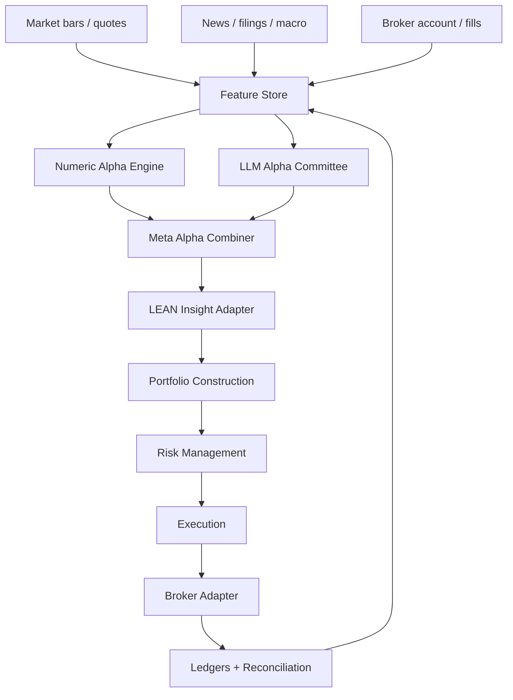

# Project Architecture

## Product Definition

Lincei is an aggressive autonomous alpha system for a personal account. The system should research, decide, backtest, size, execute, monitor, and learn. It should not stop at investment reports or control-plane ledgers.

The core loop is:

```text
Data -> Features -> Alpha Decisions -> LEAN Insights
     -> Portfolio Targets -> Risk Cuts -> Orders
     -> Fills / Positions -> Reconciliation -> Model Review
```

## Runtime Ownership

| Layer | Owner | Job |
|---|---|---|
| Data ingestion | Backend workers | Import market, news, filing, macro, and broker data with timestamps |
| Feature store | Backend / Python jobs | Build numeric and text-derived features without lookahead |
| LLM Alpha Committee | LLM orchestration service | Produce typed alpha decisions with evidence and counter-thesis |
| Numeric alpha engine | Python / LEAN | Produce rule-based or ML alpha scores |
| Meta alpha | Python / LEAN adapter | Combine numeric and LLM signals into final alpha decisions |
| LEAN engine | LEAN / QuantConnect | Backtest, paper, live, and emit orders through framework models |
| Control plane | NestJS | Store budget, ledgers, approvals, risk state, and execution evidence |
| Broker adapter | Narrow execution service | Submit/cancel/reconcile broker orders without LLM access |
| Dashboard | React | Show alpha, risk, orders, positions, blockers, and next actions |

## Target Data Flow



## Existing Components To Reuse

Keep the current control-plane work, but reposition it as infrastructure around the engine:

- budget envelopes become hard capital policy;
- risk gate becomes an outer control-plane guard;
- research runs store LEAN backtest and LLM committee artifacts;
- proposals become derived from LEAN portfolio targets, not hand-built baseline output;
- paper order plans become the first execution ledger;
- broker snapshot/fill/order ledgers become live truth reconciliation.

## Components To Build

### LEAN Workspace

Create `lean/` or `engines/lean/` as the local LEAN workspace. It should contain:

- `aggressive_llm_momentum/`;
- shared alpha components;
- shared portfolio construction components;
- shared risk models;
- local data adapters;
- result export scripts;
- test fixtures for deterministic backtests.

### Alpha Decision Store

Persist every alpha output before it becomes an order:

- numeric alpha score;
- LLM alpha decision;
- meta-alpha final score;
- input feature snapshot hash;
- model and prompt versions;
- timestamp and data availability;
- Lean backtest reference when available.

### Backtest Ingestion

Every Lean backtest must be ingested into the control plane:

- project id and algorithm version;
- parameters;
- result files and hashes;
- equity curve summary;
- order and fill summary;
- drawdown and turnover;
- Sharpe, Sortino, Calmar, information ratio;
- benchmark;
- failure notes.

### Broker Adapter

Broker write access must be a separate boundary:

- no prompt text;
- no LLM imports;
- no arbitrary generated orders;
- only signed order plans or LEAN-generated, control-plane-approved targets;
- submit, cancel, flatten, open-order polling, fill polling, and reconciliation.

## Agile Rule

Build vertical, executable slices. A slice that shows another dashboard panel but does not improve alpha generation, backtesting, sizing, execution, or reconciliation is secondary. The first valuable slice is a LEAN algorithm that can run locally, produce portfolio targets, and have its result ingested into the control plane.
