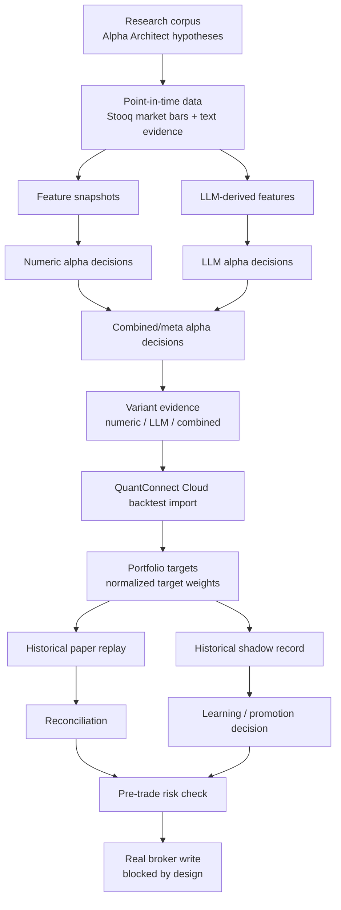

# Lincei Quant Research Engine: Current Capital Evidence Status

Status: supporting review note.

Last checked: 2026-05-29 on `Darwin arm64`.

Source of truth: [SPEC.md](SPEC.md), [terminology.md](terminology.md), and `docs/spec/`. This file explains the current implementation state in plain language. It is not the normative spec.

## 1. One-line Conclusion

The project can now run data ingestion, alpha replay, QuantConnect Cloud backtest import, portfolio target import, historical paper replay, shadow recording, learning, and pre-trade risk check through the `lincei` CLI.

It is still **not ready to trade real money** because the current paper cycle, Toss read-only reconciliation, broker-write flags, and broker credentials are intentionally missing or blocked.

## 2. Current Flow



Important boundary: the LLM participates before the backtest by producing typed semantic features and LLM alpha decisions. It does not receive broker credentials, does not create raw broker orders, and does not decide final broker quantities.

## 3. What Is Working Now

| Area | Current result |
| --- | --- |
| Stooq market data | `STOOQ_API_KEY` is configured locally; market ingestion can pass. |
| Alpha replay | `alpha run` can be repeated without duplicate key crashes. Feature snapshots, LLM event features, and alpha decisions are upserted idempotently. |
| Variant evidence | Numeric / LLM / combined variants are recorded, including passed, failed, blocked, and flat/no-order outcomes. |
| QuantConnect Cloud | REST credentials work. Project `32097697` and backtest `ecd033aae81ec9f98e1c24b4c5a58d4c` were imported. |
| Cloud strategy evidence | Imported run `qc-import-ecd033aae81e` is `passed`, runtime `quantconnect-cloud`, promotion eligible as backtest evidence. |
| Portfolio target import | Cloud portfolio target snapshot is persisted to SQLite. Current target count is 22. |
| Target normalization | Cloud symbol suffixes like `NVDA RHM8UTD8DT2D` are normalized to broker-facing tickers like `NVDA`. Sell fills no longer double-flip sign. |
| Paper replay | Historical paper replay plan `3` is `reconciled` with matched reconciliation and 2 fills. |
| Shadow record | Historical target shadow record exists and reconciles as matched. |
| Pre-trade risk check | Runs fail-closed and reports concrete blockers. |

Latest important target numbers:

| Metric | Value | Meaning |
| --- | --- | --- |
| `targetCount` | 22 | Number of imported target rows. |
| `grossExposurePct` | 0.257951 | Stored as target-weight fraction, about 25.8% gross target exposure. |
| `maxSingleNamePct` | 0.062675 | Stored as target-weight fraction, about 6.3% max single-name target. |

This fixed a serious earlier issue: Cloud targets were previously derived as roughly 48x gross exposure because sell fills were counted with the wrong sign.

## 4. What Is Still Blocked

| Area | Status | Why it matters |
| --- | --- | --- |
| Current paper cycle | `missing` | Historical replay exists, but live preflight requires current paper trading evidence for the latest target. |
| Current shadow evidence | `blocked for promotion` | Latest shadow record is `historical_target_replay`; promotion requires `current_live_shadow`. |
| Broker read-only | `blocked` | Current broker snapshot is `simulated`, not a matched Toss read-only poll. |
| Broker credentials | `missing` | Toss credential env is not configured. |
| Broker-write flags | `not ready` | `brokerWriteEnabled`, `liveTradingEnabled`, schema verification, cancel/flatten, and open-order polling flags remain false. |
| Real broker writes | `deferred` | Requires a separate user-approved broker-write implementation spec. |
| Darwinex/Zero | `deferred` | Should wait until self-funded capital evidence and track record are stronger. |

Latest preflight blocker summary:

```text
status: blocked
main blockers:
- Only historical paper replay exists for the latest LEAN target.
- Toss read-only broker snapshot is missing.
- Broker snapshot reconciliation is not matched.
- Broker credentials are missing.
- Broker-write/live-trading/schema/cancel/open-order flags are not ready.
```

## 5. Why Current Paper Is Still Missing

There are two paper modes:

| Mode | Meaning | Current state |
| --- | --- | --- |
| Historical paper replay | Replays imported historical backtest targets through the paper ledger to prove plumbing and reconciliation. | Working: plan `3`, matched. |
| Current paper cycle | Uses current-market target evidence and is allowed to count toward live preflight. | Still blocked. |

The current paper run correctly refuses to treat historical Cloud backtest targets as current-market readiness:

```text
Paper risk evaluation DENY:
- Market data is stale for the active policy.
- Paper execution requires human approval.
- Human approval is required outside dry-run mode.
```

This is the right safety behavior. It means the next core implementation should not be another dashboard. It should create a clean current-market paper cycle path.

## 6. Next Work, In Order

| Priority | Work | Direct proof |
| --- | --- | --- |
| P0 | Build a current-market paper cycle path from fresh alpha decisions and normalized long-only target candidates. Historical Cloud backtest targets must remain replay evidence only. | `bun --cwd=backend run lincei -- paper run --json` returns a reconciled current paper plan. |
| P1 | Add explicit operator approval or dry-run approval handling for current paper execution without enabling real broker writes. | Paper run records approval custody and stays broker-write disabled. |
| P2 | Implement Toss read-only account/open-order polling and reconciliation. No write calls. | `preflight run` no longer says broker snapshot is simulated or stale. |
| P3 | Keep QuantConnect Cloud import as promotion-quality backtest evidence, but separate it from current-market target generation. | Status shows Cloud evidence and current paper evidence separately. |
| P4 | Re-run learning and promotion after current paper + current shadow exist. | Promotion blocker moves from `historical_target_replay` to any remaining real blocker. |
| P5 | Only after the above, draft the broker-write spec for user approval. | No implementation before explicit approval. |

## 7. Commands Used For Review

```bash
bun --cwd=backend run lincei -- qc import-backtest --project-id 32097697 --backtest-id ecd033aae81ec9f98e1c24b4c5a58d4c --json
bun --cwd=backend run lincei -- paper replay --json
bun --cwd=backend run lincei -- shadow run --json
bun --cwd=backend run lincei -- learning run --json
bun --cwd=backend run lincei -- preflight run --json
bun --cwd=backend run lincei -- capital status --json
```

Validation run:

```bash
cd backend
bun run test -- src/runtime/create-lincei-runtime.spec.ts src/modules/v1-pilot/research/capital-evidence-slice.service.spec.ts src/modules/v1-pilot/lean/lean-cloud-artifact-mapper.spec.ts src/modules/v1-pilot/lean/lean-run-acceptance.spec.ts src/modules/v1-pilot/lean/lean-run-import.service.spec.ts src/modules/v1-pilot/lean/lean-cloud.runner.spec.ts src/modules/v1-pilot/paper/lean-paper-bridge.service.spec.ts src/modules/v1-pilot/v1-pilot-status-stage.builder.spec.ts
bun run build
```

Result: 8 focused suites / 26 tests passed, backend build passed.
