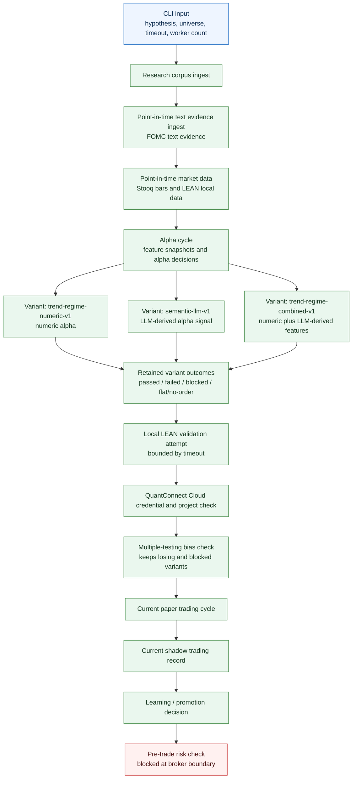
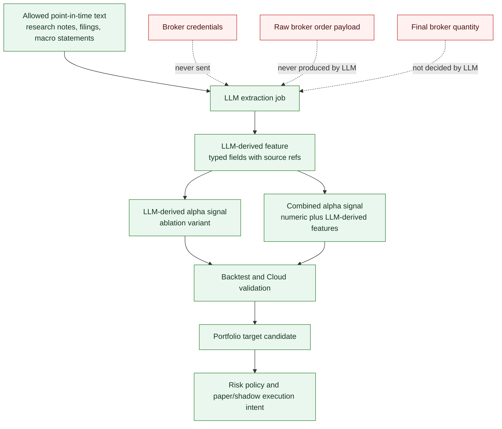
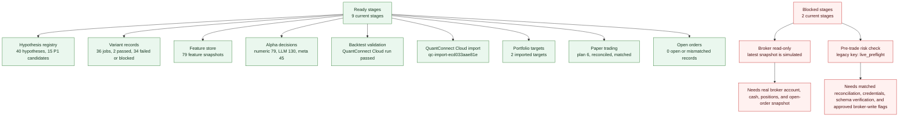

# Lincei Quant Research Engine: Project Map And Current Status

Status: supporting review note.

Last checked: 2026-06-01 on `Darwin arm64`, Bun `1.3.5`.

Source of truth: [SPEC.md](SPEC.md), [terminology.md](terminology.md), and `docs/spec/`. This file is a plain-language guide for review. It is not the normative spec.

## 1. What This Project Is

This project is trying to build a self-funded capital allocation system:

1. collect market and text data,
2. turn that data into features,
3. produce alpha decisions,
4. validate those decisions with LEAN and QuantConnect Cloud artifacts,
5. convert validated decisions into portfolio targets,
6. rehearse execution through paper trading and shadow trading,
7. reconcile intended state against observed state,
8. block before real broker writes until a separate broker-write spec and real broker integration exist.

The business goal is still real profit from the operator's own pre-funded capital first. Darwinex/Zero is a later track-record and performance-fee path, not the first implementation priority.

Important current boundary: the system does **not** submit real broker orders yet. It can produce and validate portfolio targets, but the pre-trade risk check intentionally blocks because real broker read-only snapshots, credentials, and broker-write approval are not in place.

## 2. Whole-Project Flow

```mermaid
flowchart LR
    subgraph P["Parallel research pipeline"]
        direction TB
        R["Strategy research corpus<br/>articles, papers, notes"]
        H["Hypothesis registry<br/>testable strategy claims"]
        D["Point-in-time data<br/>market bars, text evidence, availability time"]
        F["Feature generation<br/>numeric features and LLM-derived features"]
        A["Alpha decisions<br/>numeric, LLM-derived, combined"]
        V["Variant records<br/>passed, failed, blocked, flat/no-order"]
    end

    subgraph Q["Validation"]
        direction TB
        L["Local LEAN validation<br/>simulator and artifact plumbing"]
        C["QuantConnect Cloud import<br/>promotion-grade backtest artifacts"]
        B["Bias checks<br/>multiple-testing and selected-run controls"]
    end

    subgraph S["Single-writer capital gate"]
        direction TB
        T["Portfolio target<br/>symbol weights and exposure"]
        RISK["Pre-trade risk policy<br/>deterministic caps and blockers"]
        PAPER["Paper trading<br/>simulated order plan"]
        SHADOW["Shadow trading<br/>live-data decision record, no broker write"]
        RECON["Reconciliation<br/>intended versus observed state"]
        LEARN["Learning / promotion ledger<br/>accepted or blocked"]
    end

    subgraph X["Blocked broker boundary"]
        direction TB
        SNAP["Broker read-only snapshot<br/>real account, cash, positions, open orders"]
        CHECK["Pre-trade risk check<br/>fail closed"]
        WRITE["Broker-write path<br/>submit, cancel, replace, flatten"]
    end

    R --> H --> D --> F --> A --> V
    V --> L --> C --> B
    B --> T --> RISK
    RISK --> PAPER --> RECON
    RISK --> SHADOW --> LEARN
    RECON --> LEARN --> SNAP --> CHECK --> WRITE

    classDef ready fill:#eaf7ee,stroke:#2e7d32,color:#16351f
    classDef blocked fill:#fff1f0,stroke:#c62828,color:#4b1111
    class R,H,D,F,A,V,L,C,B,T,RISK,PAPER,SHADOW,RECON,LEARN ready
    class SNAP,CHECK,WRITE blocked
```



Read this as two halves:

- Before promotion, many jobs can run in parallel: data ingestion, feature generation, LLM-derived feature extraction, ablations, and backtest sweeps.
- After promotion, portfolio target consolidation, risk, paper trading, shadow trading, reconciliation, and broker checks must be single-writer and fail closed.

## 3. What `capital run` Now Does

The current main operator command is:

```bash
bun --cwd=backend run lincei -- capital run --max-backtest-workers 1 --step-timeout-ms 60000 --json
```

It is a broker-excluded vertical slice. It refreshes everything that can be proven before broker API integration.



New implementation details reflected in this flow:

| Area | Current behavior |
| --- | --- |
| Default universe | `SPY, QQQ, TLT, IEF`, a liquid ETF trend/defensive baseline. |
| Step timeout | Each major `capital run` step can return a bounded `blocked` result instead of hanging indefinitely. |
| Progress events | `capital run --json` prints machine-readable final JSON to stdout and progress/logging to stderr. |
| Variant retention | Passed, failed, blocked, and flat/no-order variants are retained to reduce multiple-testing bias. |
| LEAN timeout | `lean full-backtest` now accepts `--backtest-timeout-ms`; timeouts become explicit blockers. |
| Triage | `capital triage --json` returns one safe next action instead of forcing manual status interpretation. |

## 4. Decision Objects In Plain Language

The project does not jump from "LLM says buy" to "broker order." It passes through typed objects.

```mermaid
flowchart LR
    I["Input records<br/>SPY bar, FOMC statement, research note"] --> FS["Feature snapshot<br/>trend, volatility, regime, semantic fields"]
    FS --> AD["AlphaDecision<br/>symbol, direction, horizon, confidence, expected return"]
    AD --> INS["LEAN Insight<br/>forecast object inside LEAN"]
    INS --> PT["Portfolio target<br/>target weight and exposure"]
    PT --> INTENT["Execution intent<br/>paper/shadow only today"]
    INTENT --> REC["Reconciliation<br/>matched or blocked"]
    REC --> GATE["Pre-trade risk check<br/>unknown means blocked"]
    GATE --> ORDER["Future broker order<br/>not implemented"]

    classDef current fill:#eaf7ee,stroke:#2e7d32,color:#16351f
    classDef future fill:#fff8e1,stroke:#f9a825,color:#4d3500
    classDef blocked fill:#fff1f0,stroke:#c62828,color:#4b1111
    class I,FS,AD,INS,PT,INTENT,REC current
    class GATE blocked
    class ORDER future
```



Key terms:

| Term | Meaning in this project |
| --- | --- |
| `alpha` | A return forecast or edge estimate. It is not a broker order. |
| `feature` | An input available at decision time. |
| `LLM-derived feature` | Structured data extracted by an LLM from allowed point-in-time inputs. |
| `AlphaDecision` | A typed forecast record: direction, confidence, horizon, expected return, and refs. |
| `Portfolio target` | The intended exposure after portfolio construction and risk policy. |
| `paper trading` | Simulated execution with paper account semantics. |
| `shadow trading` | Live-data decision recording without broker writes. |
| `pre-trade risk check` | Deterministic gate before execution-like action; unknown state blocks. |
| `broker-write path` | Future submit/cancel/replace/flatten path; still out of scope. |

## 5. Where The LLM Is Allowed

The LLM is inside the alpha research loop, not inside the broker-write boundary.



This is why `semantic-llm-v1` exists as a variant: it is tested against numeric and combined variants. It does not receive account credentials and it does not bypass portfolio or risk controls.

## 6. Current Status From `capital triage`

Latest command:

```bash
bun --cwd=backend run lincei -- capital triage --json
```

Current milestone: `self-funded-capital-evidence`

| Count | Value |
| --- | ---: |
| ready stages | 9 |
| blocked stages | 2 |
| missing stages | 0 |
| deferred stages | 3 |



Recommended safe next action from triage:

```bash
bun --cwd=backend run lincei -- broker status --json
```

Why this is the recommendation: the active blocker is broker-read-only evidence. `broker status` shows whether credentials, schema verification, read-only polling, fill polling, and credential custody are ready. If provider API onboarding is blocked by login/certificate issues, use manual read-only file import instead:

```bash
bun --cwd=backend run lincei -- broker import-snapshot --file /path/to/snapshot.csv --json
bun --cwd=backend run lincei -- broker import-fills --file /path/to/fills.csv --json
```

## 7. What Is Done Versus Not Done

| Area | Status | Meaning |
| --- | --- | --- |
| Strategy research corpus | implemented | Research hypotheses can be registered and reused. |
| Point-in-time market data | implemented | Stooq-backed data ingestion and LEAN local data preparation exist. |
| LLM-derived features | implemented | LLM output is structured as features and alpha variants. |
| Numeric / LLM / combined variants | implemented | Variants are retained even when failed, blocked, or flat/no-order. |
| Local LEAN validation | implemented but operationally bounded | It can run or block with timeout; local LEAN is not Cloud promotion evidence by itself. |
| QuantConnect Cloud import | implemented | Cloud project/backtest artifacts can be imported when credentials and ids exist. |
| Portfolio target generation | implemented | Validated alpha can become target weights and exposure. |
| Paper trading | implemented | Current paper plans can be created and reconciled. |
| Shadow trading | implemented | Live-data decisions can be recorded without broker writes. |
| Learning / promotion ledger | implemented | Promotion decisions can be accepted or blocked from artifacts. |
| Capital triage CLI | implemented | One next safe operator action can be derived from status. |
| Broker read-only CLI | implemented | Read-only status, snapshot poll, manual snapshot/fill file import, fill poll, and reconciliation are available through `lincei broker ...`. |
| Provider API-backed broker read-only integration | blocked | KIS/Toss/other provider onboarding and schema verification are not complete yet. |
| Manual broker read-only import | implemented | Exported CSV/JSON account snapshots and fills can be imported without broker writes. |
| Broker-write path | not implemented | Needs explicit user-approved broker-write spec before code. |
| Darwinex/Zero | deferred | Should follow self-funded track record, not precede it. |

## 8. How Money Eventually Enters The Loop

```mermaid
flowchart LR
    NOW["Current repo state<br/>broker-excluded evidence loop"] --> READONLY["Next required broker step<br/>read-only account snapshot"]
    READONLY --> MATCH["Reconciliation<br/>broker snapshot matches local intended state"]
    MATCH --> SPEC["User-approved broker-write spec<br/>submit/cancel/replace/flatten rules"]
    SPEC --> SMALLCAP["Self-funded capital allocation<br/>pre-funded operator capital"]
    SMALLCAP --> TRACK["Real track record<br/>after-cost returns and drawdowns"]
    TRACK --> DARWIN["Darwinex/Zero path<br/>later performance-fee opportunity"]

    classDef now fill:#eaf7ee,stroke:#2e7d32,color:#16351f
    classDef blocked fill:#fff1f0,stroke:#c62828,color:#4b1111
    classDef future fill:#fff8e1,stroke:#f9a825,color:#4d3500
    class NOW now
    class READONLY,MATCH,SPEC blocked
    class SMALLCAP,TRACK,DARWIN future
```



The next real-money blocker is not "the strategy cannot think." The current blocker is that the system cannot yet prove real broker account state, reconcile it, or submit/cancel/replace/flatten orders under an approved broker-write spec.

## 9. Review Commands

Use these commands to inspect the current state:

```bash
bun --cwd=backend run lincei -- capital triage --json
bun --cwd=backend run lincei -- capital status --json
bun --cwd=backend run lincei -- broker status --json
bun --cwd=backend run lincei -- broker poll-read-only --json
bun --cwd=backend run lincei -- broker import-snapshot --file /path/to/snapshot.csv --json
bun --cwd=backend run lincei -- broker import-fills --file /path/to/fills.csv --json
bun --cwd=backend run lincei -- broker reconcile-snapshot --json
bun --cwd=backend run lincei -- capital run --max-backtest-workers 1 --step-timeout-ms 60000 --json
```

Focused validation for the latest implementation:

```bash
cd backend
bun run test -- src/modules/v1-pilot/research/capital-evidence-slice.service.spec.ts src/cli/lincei.spec.ts src/cli/capital-triage.spec.ts src/modules/v1-pilot/lean/lean-cli.runner.spec.ts
bun run build
```

Latest direct status check used for this document: `capital triage --json` returned `blocked` with one recommended safe action and exact broker-boundary blockers.
