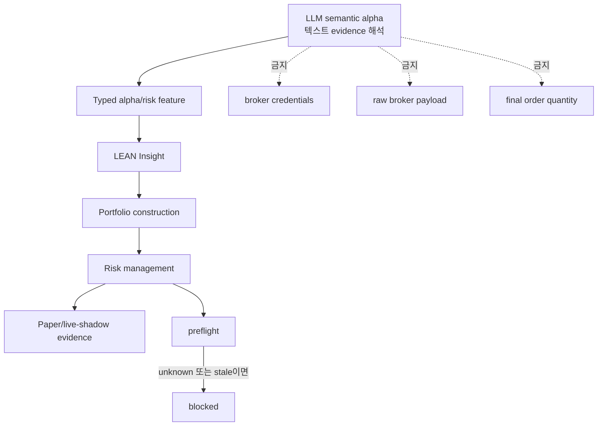
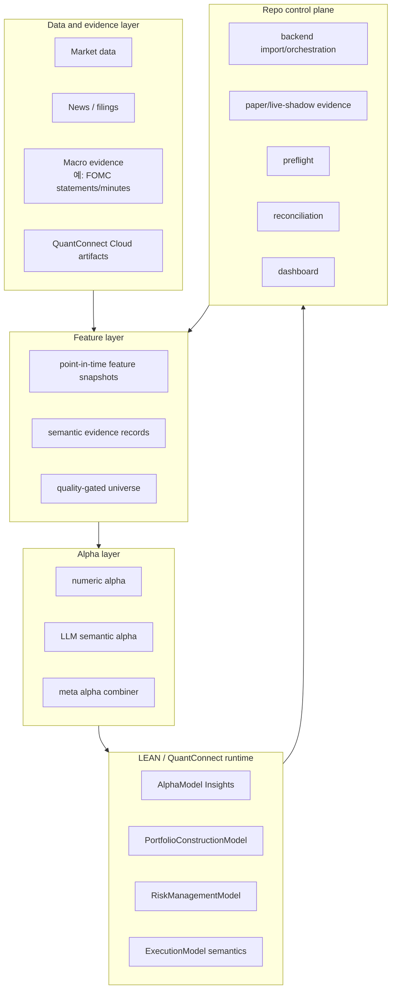
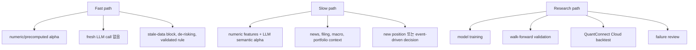
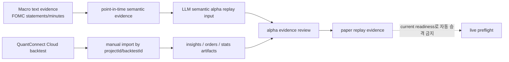
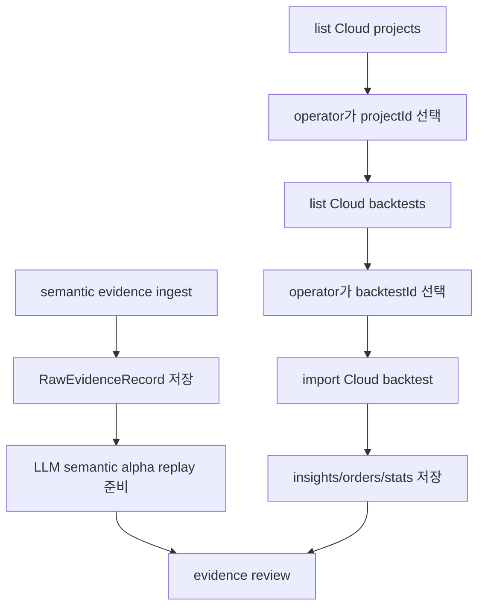
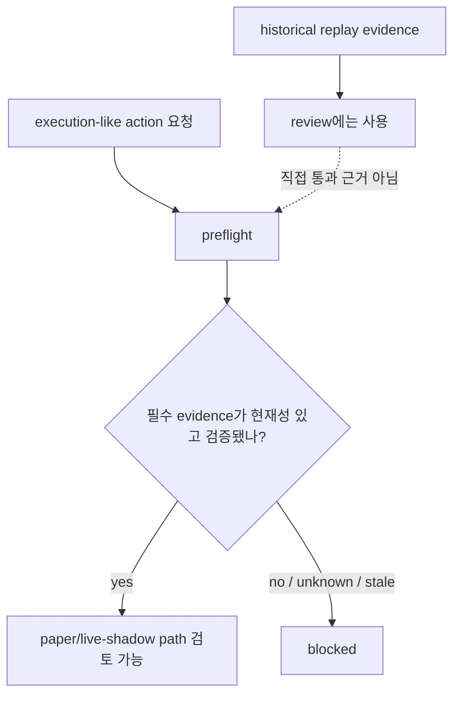

# Lincei Quant Research Engine 이해 가이드

Status: 전체 프로젝트를 이해하기 위한 supporting review note.

이 문서는 프로젝트를 처음 보는 사람이 큰 그림부터 잡을 수 있도록 만든 설명서입니다. 정식 specification은 `SPEC.md`와 `docs/spec/` 아래 문서들이며, 이 파일은 그 내용을 더 쉽게 읽기 위한 안내문입니다.

## 1. 한 문장으로 말하면

이 프로젝트는 "투자 근거를 읽고, alpha를 만들고, QuantConnect/LEAN에서 검증하고, portfolio와 risk rule을 통과시킨 뒤, paper 또는 live-shadow evidence로 기록하고, 결과를 reconciliation해서 다시 학습하는 시스템"입니다.

여기서 중요한 점은 자동으로 실제 돈을 거래하는 것이 아닙니다. 현재 milestone의 목표는 검증 가능한 alpha/execution evidence loop를 만드는 것입니다.

## 2. 먼저 봐야 하는 핵심 loop

이 프로젝트를 이해할 때는 파일 이름이나 내부 모듈 이름부터 보면 헷갈립니다. 먼저 아래 loop만 잡으면 됩니다.

```mermaid
flowchart LR
    A["1. Evidence<br/>그 시점에 알 수 있었던 근거"] --> B["2. Feature snapshot<br/>point-in-time 입력"]
    B --> C["3. Alpha decision<br/>수익 방향성 판단"]
    C --> D["4. LEAN Insight<br/>전략 runtime으로 전달"]
    D --> E["5. Portfolio target<br/>목표 비중"]
    E --> F["6. Risk cut<br/>위험 제한"]
    F --> G["7. Paper/live-shadow intent<br/>실제 broker write 없이 기록"]
    G --> H["8. Fill 또는 would-have-traded evidence"]
    H --> I["9. Reconciliation<br/>의도와 결과 비교"]
    I --> J["10. Learning loop<br/>다음 판단 개선"]
```



쉽게 풀면 이렇습니다.

1. 시스템은 뉴스, filing, macro data, market data 같은 evidence를 읽습니다.
2. 그 evidence가 특정 시점에 정말 사용 가능했는지 point-in-time으로 정리합니다.
3. numeric model과 LLM semantic alpha가 alpha decision을 만듭니다.
4. alpha decision은 LEAN의 `Insight`로 변환됩니다.
5. LEAN이 portfolio target을 만듭니다.
6. risk model이 너무 큰 exposure나 stale data 같은 위험을 줄이거나 막습니다.
7. 현재 scope에서는 실제 broker order가 아니라 paper trading 또는 live-shadow evidence를 남깁니다.
8. 결과를 import하고 reconciliation합니다.
9. 그 결과를 다음 alpha 판단과 promotion review에 씁니다.

이 loop가 프로젝트의 중심입니다. Dashboard, README, runbook, ledger는 이 loop를 설명하거나 검증하기 위한 보조 수단입니다.

## 3. 왜 이렇게 복잡한가

투자 시스템에서 가장 위험한 착시는 "좋아 보이는 backtest"입니다. 특히 아래 문제가 있으면 결과가 그럴듯해도 믿기 어렵습니다.

- 미래 정보를 과거 시점에서 사용한 lookahead bias
- local simulator 결과를 QuantConnect Cloud promotion evidence처럼 취급하는 문제
- LLM이 자유 텍스트로 trade를 말하고, 그 말이 broker order처럼 흐르는 문제
- historical replay evidence를 current live readiness로 착각하는 문제
- risk gate가 unknown state를 ready로 처리하는 문제

그래서 이 프로젝트는 alpha를 만드는 부분과 broker-write path를 강하게 분리합니다.



LLM은 중요한 역할을 합니다. 다만 LLM은 broker credential을 보거나, 최종 주문 수량을 정하거나, raw broker payload를 만들면 안 됩니다. LLM의 역할은 typed semantic alpha feature와 risk judgment를 만드는 데 제한됩니다.

## 4. 큰 구성 요소

아래 그림은 프로젝트 전체를 레이어별로 본 것입니다.



각 레이어를 더 쉽게 설명하면:

| 레이어 | 하는 일 | 보면 좋은 질문 |
|---|---|---|
| Data and evidence | 시장 데이터, 뉴스, filing, macro text, Cloud artifact를 가져옵니다. | 이 데이터가 언제 사용 가능했는가? |
| Feature layer | raw evidence를 point-in-time feature로 바꿉니다. | backtest 시점에 미래 정보를 읽지 않는가? |
| Alpha layer | numeric model과 LLM이 alpha forecast를 만듭니다. | output이 typed contract인가? |
| LEAN runtime | alpha를 `Insight`, portfolio target, risk adjustment로 실행 가능한 전략 흐름에 넣습니다. | LEAN이 strategy semantics를 소유하는가? |
| Repo control plane | import, evidence 기록, paper/live-shadow, preflight, dashboard를 담당합니다. | broker-write boundary가 fail closed인가? |

## 5. 주요 용어를 필요한 순서로 이해하기

처음부터 모든 용어를 외울 필요는 없습니다. 아래 순서로 이해하면 됩니다.

| 용어 | 쉬운 설명 | 이 프로젝트에서 중요한 이유 |
|---|---|---|
| evidence | 판단의 근거가 되는 원천 자료입니다. 예: 가격, filing, FOMC statement. | alpha가 어디서 나왔는지 추적해야 합니다. |
| point-in-time | 그 시점에 실제로 알 수 있었던 정보만 쓰는 방식입니다. | lookahead bias를 막습니다. |
| `availableAt` | evidence를 전략이 사용할 수 있게 된 가장 이른 시각입니다. | backtest에서 미래 정보 사용을 막는 기준입니다. |
| feature snapshot | 특정 decision time에 사용 가능한 입력 묶음입니다. | alpha replay의 재료입니다. |
| alpha | 수익 방향성이나 edge에 대한 forecast입니다. | 전략의 출발점입니다. |
| semantic alpha feature | LLM이 텍스트 evidence에서 만든 구조화된 alpha 입력입니다. | LLM을 쓰되 free-form trade text를 막습니다. |
| AlphaDecision | alpha source가 내는 typed decision입니다. | symbol, horizon, direction, confidence, evidenceRefs 등을 고정합니다. |
| LEAN | QuantConnect의 algorithmic trading engine입니다. | backtest와 strategy runtime의 중심입니다. |
| Insight | LEAN에서 forecast를 표현하는 객체입니다. | alpha가 portfolio sizing으로 넘어가는 다리입니다. |
| portfolio target | 어떤 symbol을 어느 비중으로 가질지에 대한 목표입니다. | alpha를 position으로 바꾸는 단계입니다. |
| risk cut | 위험 규칙에 따라 target을 줄이거나 막는 조치입니다. | concentration, stale data, cap bypass를 막습니다. |
| paper trading | simulated account semantics로 주문 의도를 검증합니다. | 실제 broker write 없이 execution path를 봅니다. |
| live-shadow | live data로 decision을 기록하지만 broker write는 하지 않습니다. | 현재성 있는 evidence를 안전하게 쌓습니다. |
| preflight | execution-like action 전에 통과해야 하는 deterministic gate입니다. | unknown state는 blocked가 되어야 합니다. |
| reconciliation | 의도한 상태와 관측된 상태를 비교합니다. | duplicate submit, stale fill, mismatch를 잡습니다. |

## 6. 현재 scope와 아닌 것

현재 active scope:

- QuantConnect Cloud와 LEAN 중심의 alpha validation runtime
- local LEAN smoke/debug run
- Cloud backtest/import evidence
- point-in-time semantic alpha replay
- paper 또는 live-shadow evidence
- fail-closed preflight
- reconciliation과 learning loop

현재 scope가 아닌 것:

- automatic production/live trading
- real broker writes
- unrestricted margin, leverage, derivatives, shorts, HFT
- LLM이 직접 broker order를 만드는 구조
- local simulator result를 promotion evidence로 주장하는 것
- UI polish가 core alpha/execution loop보다 앞서는 것

한 문장으로 정리하면:

> 지금 목표는 "실제 돈을 움직이는 시스템"이 아니라 "나중에 capital allocation을 판단할 수 있을 만큼 evidence loop를 엄격하게 만드는 시스템"입니다.

## 7. 세 가지 실행 경로

프로젝트에는 latency와 목적이 다른 세 가지 path가 있습니다.



Fast path는 빠른 방어적 판단에 가깝고, slow path는 LLM semantic alpha를 포함하는 판단입니다. Research path는 새로운 전략과 promotion evidence를 만드는 긴 흐름입니다.

## 8. 이 repository 안에서 각 폴더가 맡는 역할

| 위치 | 역할 |
|---|---|
| `SPEC.md` | active specification index입니다. 프로젝트 방향의 기준입니다. |
| `docs/spec/` | long-term spec입니다. scope, runtime, LLM boundary, testing policy를 정의합니다. |
| `backend/` | repo control plane입니다. ingestion, import, status, paper/live-shadow, preflight, reconciliation을 담당합니다. |
| `frontend/` | operator dashboard입니다. state와 blocker를 보여주는 read-only operational surface입니다. |
| `engines/lean/` | LEAN strategy runtime code입니다. backtest와 algorithm behavior가 여기에 있습니다. |
| `scripts/` | operator command wrappers입니다. backtest, import, paper/live-shadow, preflight 등을 실행합니다. |
| `data/` | local evidence나 fixture성 데이터가 위치할 수 있습니다. promotion evidence와 구분해야 합니다. |
| `artifacts/` | run 결과물이 쌓이는 위치입니다. 무엇을 증명하는 artifact인지 분리해서 봐야 합니다. |
| `result.md` | 지금 읽고 있는 전체 프로젝트 이해용 review note입니다. |

주의할 점: `backend/src/modules/v1-pilot/**` 같은 이름의 `v1-pilot`은 legacy identifier에 가깝습니다. 현재 active direction은 old live-pilot scope가 아니라 QuantConnect Cloud + LEAN validation runtime입니다.

## 9. 이번 PR은 전체 구조에서 어디를 보강하나

현재 PR #23은 전체 프로젝트 중 아래 부분을 보강합니다.



즉, 이번 PR은 전체 시스템의 두 약한 부분을 메우는 작업입니다.

첫째, LLM이 읽는 text evidence를 point-in-time으로 저장합니다. 그래야 나중에 LLM alpha가 미래 정보를 읽지 않았는지 확인할 수 있습니다.

둘째, QuantConnect Cloud backtest 결과를 repo로 import합니다. 그래야 Cloud에서 실제로 나온 insights, orders, stats를 control plane이 evidence로 다룰 수 있습니다.

셋째, historical paper replay evidence와 current live readiness를 분리합니다. 과거 replay가 있다고 해서 지금 live preflight가 통과되면 안 됩니다.

## 10. 이번 PR에서 추가된 operator flow

이번 PR이 추가한 흐름은 아래처럼 이해하면 됩니다.



사용하는 command는 다음입니다.

```bash
./scripts/ingest-semantic-evidence --source hf-fomc-statements-minutes --limit 80
./scripts/list-cloud-projects
./scripts/list-cloud-backtests --project-id <project-id> --limit 10
./scripts/import-cloud-backtest --project-id <project-id> --backtest-id <backtest-id>
```

여기서 operator가 `projectId`와 `backtestId`를 명시적으로 고르는 이유는 중요합니다. 시스템이 좋은 결과만 몰래 고르면 promotion evidence가 왜곡될 수 있습니다.

## 11. 안전 경계

이 프로젝트의 safety model은 "unknown이면 blocked"입니다.



핵심 원칙:

- historical replay evidence는 current live readiness가 아닙니다.
- LLM output은 final order quantity가 아닙니다.
- frontend는 broker credential을 보면 안 됩니다.
- real broker writes는 현재 scope가 아닙니다.
- local simulator output은 Cloud promotion evidence가 아닙니다.
- preflight에서 unknown state는 ready가 아니라 blocked입니다.

## 12. 현재 무엇이 검증됐고, 무엇은 아직 아닌가

검증된 것:

- targeted backend tests가 semantic evidence ingestion, Cloud import, run import, paper bridge behavior를 보호합니다.
- frontend dashboard tests와 typecheck/build가 통과했습니다.
- Cloud import path는 code와 tests로 구현되어 있습니다.
- paper replay evidence와 live readiness가 분리됐습니다.
- documentation은 current direction을 설명하도록 업데이트됐습니다.

아직 직접 evidence가 필요한 것:

- 실제 QuantConnect REST credentials로 Cloud project를 조회하는 것
- 실제 `projectId`와 `backtestId`를 골라 Cloud backtest를 import하는 것
- import된 Cloud artifacts를 바탕으로 paper/live-shadow/learning/preflight command를 이어서 실행하는 것
- unit-test evidence와 direct execution evidence를 분리해서 보고하는 것

중요한 구분:

```text
Unit test passed
  = code contract가 보호됨

QuantConnect Cloud import succeeded with real projectId/backtestId
  = 실제 Cloud evidence가 repo control plane으로 들어옴

Preflight blocked
  = 정책이 실패한 것이 아니라, unknown/stale/live-scope 위험을 막은 것일 수 있음
```

## 13. 처음 읽는 사람을 위한 코드 읽기 순서

전체 diff를 무작정 읽기보다 이 순서가 좋습니다.

1. `SPEC.md`

   프로젝트가 무엇을 목표로 하고 무엇을 금지하는지 먼저 봅니다.

2. `docs/spec/01-quantconnect-lean-runtime.md`

   QuantConnect Cloud, local LEAN, repo control plane의 역할 분담을 봅니다.

3. `docs/spec/02-llm-semantic-alpha-engine.md`

   LLM이 alpha loop 안에서 무엇을 할 수 있고, broker boundary를 왜 넘으면 안 되는지 봅니다.

4. `docs/spec/04-risk-execution-and-broker-boundary.md`

   paper/live-shadow, preflight, broker-write boundary를 봅니다.

5. `backend/src/modules/v1-pilot/alpha/huggingface-semantic-evidence-ingest.service.ts`

   이번 PR의 semantic evidence ingestion이 어떻게 생겼는지 봅니다.

6. `backend/src/modules/v1-pilot/lean/lean-cloud-rest-importer.ts`

   QuantConnect Cloud import가 어떤 artifact를 가져오는지 봅니다.

7. `backend/src/modules/v1-pilot/paper/lean-paper-bridge.service.ts`

   replay evidence가 paper budget policy와 어떻게 연결되는지 봅니다.

8. `backend/src/modules/v1-pilot/live/live-preflight.service.ts`

   current readiness가 없을 때 왜 blocked가 유지되는지 봅니다.

9. `frontend/src/components/backtest-cycle-dashboard/cycleModel.ts`

   dashboard가 전체 loop를 어떻게 읽기 쉽게 보여주는지 봅니다.

10. `docs/full-lean-backtest-setup.md`

    operator가 어떤 command를 실행하고, 각 command가 무엇을 증명하는지 봅니다.

## 14. 리뷰할 때의 체크리스트

전체 프로젝트 관점에서 리뷰할 질문은 아래입니다.

### Core loop

- data -> alpha -> LEAN Insight -> portfolio target -> risk -> paper/live-shadow -> reconciliation 흐름이 더 강해졌는가?
- UI나 문서가 core loop를 대신하는 척하지 않는가?

### Point-in-time discipline

- evidence에 `asOf`와 `availableAt`이 구분되는가?
- semantic alpha replay가 lookahead bias를 줄이는 방향인가?

### QuantConnect Cloud evidence

- Cloud `projectId`와 `backtestId`를 보존하는가?
- insights, orders, stats가 누락되거나 일부 page만 import되는 위험을 줄였는가?
- operator가 어떤 Cloud run을 가져왔는지 추적할 수 있는가?

### LLM boundary

- LLM은 typed semantic alpha feature를 만들 뿐인가?
- LLM이 broker credential, raw broker payload, final order quantity로 넘어가지 않는가?

### Preflight and readiness

- historical replay evidence가 current live readiness로 승격되지 않는가?
- unknown, stale, missing evidence가 blocked로 남는가?

### Documentation

- 문서가 command, acceptance criteria, blocker를 구체적으로 말하는가?
- live-money scope를 은근히 넓히지 않는가?

## 15. 이 문서 기준의 현재 결론

현재 branch는 전체 프로젝트의 core loop 중에서 "point-in-time semantic evidence"와 "QuantConnect Cloud backtest import evidence"를 보강합니다.

이것은 dashboard polish보다 중요한 작업입니다. 이유는 프로젝트의 현재 핵심 gap이 UI가 아니라 Cloud promotion evidence와 LLM semantic-alpha replay이기 때문입니다.

다만 아직 real Cloud promotion evidence가 완성된 것은 아닙니다. 정확한 상태는 아래입니다.

> Import path와 typed boundary는 구현되고 테스트됐습니다. 하지만 실제 Cloud promotion evidence는 operator가 QuantConnect REST credentials, `projectId`, `backtestId`를 제공하고 import command를 실행한 뒤에 생깁니다. Live preflight는 현재 scope에서 계속 fail closed입니다.
