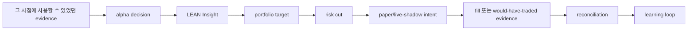
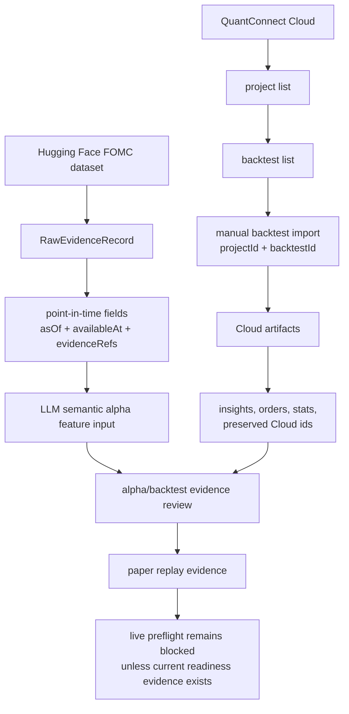
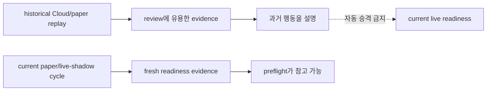
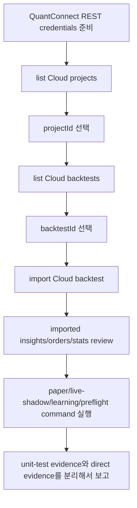

# 리뷰 가이드: Semantic Evidence And Cloud Backtest Import

Status: PR #23 리뷰를 돕기 위한 supporting review note.

이 문서는 프로젝트를 처음 보는 사람이 현재 PR을 이해할 수 있도록 만든 설명서입니다. 정식 specification은 `SPEC.md`와 `docs/spec/` 아래 문서들이고, 이 파일은 리뷰용 안내문입니다.

## 1. 이 프로젝트는 무엇을 만들고 있나

이 프로젝트는 단순한 투자 대시보드가 아닙니다. 목표는 "투자 아이디어가 실제로 검증 가능한 절차를 따라 움직일 수 있는가"를 확인하는 autonomous alpha research system입니다.

가장 중요한 핵심 loop는 아래입니다.



쉽게 말하면:

1. 시스템이 어떤 근거를 읽고,
2. 그 근거로 투자 방향성인 alpha를 만들고,
3. QuantConnect/LEAN에서 backtest하거나 실행 가능 형태로 바꾸고,
4. portfolio sizing과 risk rule을 통과시키고,
5. 실제 주문이 아니라 paper 또는 live-shadow evidence로 기록하고,
6. 결과를 reconciliation해서 다음 학습에 반영하는 구조입니다.

이 loop가 이어져야 프로젝트가 의미가 있습니다. 대시보드, 문서, ledger는 이 loop를 보여주고 검증하기 위한 보조 수단입니다.

## 2. 이번 PR이 해결하려는 핵심 문제

이번 branch가 집중한 문제는 두 가지입니다.

### 문제 1: LLM이 읽은 텍스트 근거가 point-in-time인지 확인해야 함

LLM은 뉴스, FOMC statement, minutes 같은 텍스트를 읽고 semantic alpha feature를 만들 수 있습니다. 하지만 여기서 가장 위험한 것은 lookahead bias입니다.

예를 들어 2024년 1월 1일 시점의 backtest를 한다면서, 실제로는 2024년 1월 10일에 공개된 정보를 LLM이 읽으면 안 됩니다. 그래서 evidence에는 `availableAt`이 필요합니다.

- `asOf`: 이 evidence가 다루는 기준 시점
- `availableAt`: 전략이 이 evidence를 사용할 수 있게 된 가장 이른 시점
- `evidenceRefs`: 나중에 다시 추적할 수 있는 근거 참조

이번 PR은 Hugging Face의 FOMC statement/minutes 데이터를 가져와 이런 point-in-time evidence로 저장하는 길을 추가합니다.

### 문제 2: QuantConnect Cloud backtest 결과를 repo로 가져와야 함

Local LEAN run은 빠른 디버깅에는 유용합니다. 하지만 local simulator 결과만으로는 promotion evidence라고 부르기 어렵습니다.

이 프로젝트의 현재 방향은 QuantConnect Cloud와 LEAN을 strategy validation runtime으로 쓰는 것입니다. 따라서 Cloud에서 돌린 backtest 결과를 repo control plane으로 가져와야 합니다.

이번 PR은 QuantConnect Cloud에서:

- project 목록을 보고,
- backtest 목록을 보고,
- 특정 `projectId`와 `backtestId`를 골라,
- insights, orders, stats 같은 artifact를 import하는 경로를 추가합니다.

## 3. 이번 PR의 전체 흐름

이번 PR을 한 장으로 보면 아래 흐름입니다.



두 입력이 같은 review path로 들어온다고 보면 됩니다.

- 왼쪽: "전략이 그 시점에 무엇을 알고 있었나?"
- 오른쪽: "QuantConnect Cloud backtest에서 전략이 무엇을 했다고 기록됐나?"

이 둘을 합치면 alpha decision을 더 나중에 replay하고 audit하기 쉬워집니다.

## 4. 용어를 순서대로 이해하기

처음부터 용어가 한꺼번에 나오면 이해하기 어렵습니다. 이번 PR을 볼 때는 아래 순서로 이해하면 됩니다.

| 용어 | 이 PR에서의 의미 | 왜 중요한가 |
|---|---|---|
| evidence | 전략이나 LLM이 참고할 원천 근거입니다. 예: FOMC statement, minutes. | alpha가 어디서 나왔는지 추적해야 합니다. |
| `availableAt` | evidence를 사용할 수 있게 된 가장 이른 시각입니다. | lookahead bias를 막습니다. |
| semantic alpha feature | 텍스트 evidence에서 LLM이 만든 구조화된 alpha 입력입니다. | LLM을 alpha loop 안에 넣되 broker order와 분리합니다. |
| QuantConnect Cloud | QuantConnect의 managed backtest/research 환경입니다. | local run보다 강한 backtest evidence를 만들 수 있습니다. |
| LEAN | QuantConnect의 open-source algorithmic trading engine입니다. | backtest, Insight, portfolio, risk, execution semantics를 담당합니다. |
| Insight | LEAN에서 alpha forecast를 표현하는 객체입니다. | alpha decision이 portfolio target으로 넘어가는 중간 형태입니다. |
| paper replay evidence | 과거 backtest나 import 결과를 paper-like evidence로 재구성한 것입니다. | 리뷰에는 유용하지만 현재 live readiness와는 다릅니다. |
| preflight | execution-like action 전에 통과해야 하는 deterministic gate입니다. | unknown 또는 stale 상태는 blocked가 되어야 합니다. |
| live-shadow | live data로 decision을 기록하지만 broker write는 하지 않는 모드입니다. | 실제 주문 없이 현재성 있는 evidence를 쌓을 수 있습니다. |

## 5. 실제로 바뀐 것

### 5.1 Semantic evidence ingestion

새 command:

```bash
./scripts/ingest-semantic-evidence --source hf-fomc-statements-minutes --limit 80
```

이 command는 Hugging Face의 FOMC statement/minutes 데이터를 가져와 raw semantic evidence record로 저장합니다.

리뷰할 때 볼 핵심은 "이 데이터가 나중에 LLM semantic alpha replay에 쓰여도 lookahead bias를 만들지 않는가"입니다.

### 5.2 QuantConnect Cloud project/backtest 조회

새 command:

```bash
./scripts/list-cloud-projects
./scripts/list-cloud-backtests --project-id <project-id> --limit 10
```

operator가 Cloud project와 backtest를 직접 확인할 수 있게 합니다.

여기서 중요한 점은 자동으로 임의의 winning backtest를 고르는 구조가 아니라는 것입니다. operator가 명시적으로 `projectId`와 `backtestId`를 선택해야 합니다.

### 5.3 QuantConnect Cloud backtest import

새 command:

```bash
./scripts/import-cloud-backtest --project-id <project-id> --backtest-id <backtest-id>
```

이 command는 선택한 Cloud backtest의 artifacts를 repo로 가져옵니다. 특히 다음이 중요합니다.

- Cloud `projectId`와 `backtestId`를 보존합니다.
- insights와 orders를 import합니다.
- paginated result를 처리합니다.
- page retry를 합니다.
- Cloud stats가 string으로 오는 경우도 parse합니다.
- artifact count를 기록합니다.

리뷰 포인트는 "Cloud evidence를 일부만 가져오거나, 실패한 page를 숨기거나, 원본 Cloud id를 잃어버리지 않는가"입니다.

### 5.4 Paper replay evidence와 live readiness 분리

이번 PR에서 가장 중요한 safety boundary 중 하나입니다.

Historical paper replay evidence는 과거 backtest나 import 결과를 바탕으로 "그때라면 이렇게 했을 것"을 보여줍니다. 하지만 이것은 "지금 live로 해도 된다"는 뜻이 아닙니다.



따라서 live preflight는 여전히 fail closed입니다. 현재 paper-cycle evidence나 live-shadow evidence가 없으면 blocked가 맞습니다.

### 5.5 Read-only dashboard

frontend root route는 backtest-cycle dashboard를 보여주도록 바뀌었습니다.

이 dashboard는 broker control panel이 아닙니다. operator가 다음 흐름을 한눈에 보기 위한 read-only review surface입니다.

```text
semantic evidence -> alpha -> Cloud/LEAN backtest evidence -> portfolio targets
-> paper/live-shadow -> preflight -> learning
```

리뷰할 때는 dashboard가 policy gate를 우회하지 않는지 보면 됩니다. 보여주는 것은 괜찮지만, preflight나 broker-write boundary를 느슨하게 만들면 안 됩니다.

### 5.6 Documentation

README, runbook, spec-linked docs가 현재 workflow에 맞게 업데이트됐습니다.

문서가 설명하는 것은:

- FOMC semantic evidence ingestion
- manual QuantConnect Cloud backtest import
- Cloud import에는 실제 credential env와 `projectId/backtestId`가 필요하다는 점
- live preflight는 계속 fail closed라는 점

문서가 말하면 안 되는 것은:

- real-money trading이 준비됐다는 주장
- broker write가 가능하다는 주장
- local simulator result가 promotion evidence라는 주장

## 6. 이번 PR이 하지 않는 것

이번 PR은 아래를 하지 않습니다.

- real-money trading 활성화
- broker write permission 추가
- leverage, derivatives, capital limit 변경
- LLM이 final order quantity를 결정
- LLM이 broker credential을 봄
- historical paper replay를 current live readiness로 취급
- local simulator result를 promotion evidence로 주장

즉, alpha/backtest evidence path를 보강하지만 broker-write scope는 넓히지 않습니다.

## 7. 리뷰는 어떤 순서로 하면 좋은가

### Step 1: Evidence boundary

먼저 Hugging Face FOMC 데이터가 typed evidence로 들어오는지 봅니다.

체크할 질문:

- `asOf`와 `availableAt`이 구분되는가?
- source ref를 나중에 추적할 수 있는가?
- LLM semantic alpha replay에서 미래 정보를 잘못 읽을 가능성을 줄였는가?

### Step 2: Cloud import boundary

그다음 QuantConnect Cloud importer를 봅니다.

체크할 질문:

- `projectId`와 `backtestId`가 보존되는가?
- insights, orders, stats를 가져오는가?
- pagination과 retry가 있는가?
- partial import가 숨겨지지 않는가?

### Step 3: Readiness boundary

paper replay와 current readiness가 섞이지 않는지 봅니다.

체크할 질문:

- historical replay evidence는 evidence로만 표시되는가?
- current paper/live-shadow evidence가 없으면 preflight가 blocked를 유지하는가?
- unknown state가 ready로 취급되지 않는가?

### Step 4: Dashboard

dashboard는 loop와 blocker를 설명하는 surface로만 동작해야 합니다.

체크할 질문:

- dashboard가 operator에게 어떤 evidence가 있고 무엇이 blocked인지 설명하는가?
- dashboard가 backend policy gate를 우회하지 않는가?

### Step 5: Docs

문서가 scope를 정확히 설명하는지 봅니다.

체크할 질문:

- command와 acceptance criteria가 명확한가?
- Cloud import가 credential/project/backtest에 의존한다는 blocker를 숨기지 않는가?
- live readiness를 과장하지 않는가?

## 8. 먼저 읽을 파일

전체 diff를 처음부터 다 읽기보다 아래 순서가 이해하기 쉽습니다.

| 목적 | 파일 |
|---|---|
| semantic evidence ingestion 이해 | `backend/src/modules/v1-pilot/alpha/huggingface-semantic-evidence-ingest.service.ts` |
| Cloud REST import 이해 | `backend/src/modules/v1-pilot/lean/lean-cloud-rest-importer.ts` |
| manual Cloud import 이해 | `backend/src/modules/v1-pilot/lean/lean-cloud-manual-importer.ts` |
| paper replay와 readiness 분리 이해 | `backend/src/modules/v1-pilot/paper/lean-paper-bridge.service.ts` |
| live preflight boundary 확인 | `backend/src/modules/v1-pilot/live/live-preflight.service.ts` |
| dashboard가 무엇을 보여주는지 이해 | `frontend/src/components/backtest-cycle-dashboard/cycleModel.ts` |
| operator command 확인 | `scripts/ingest-semantic-evidence`, `scripts/list-cloud-projects`, `scripts/list-cloud-backtests`, `scripts/import-cloud-backtest` |
| operator runbook 확인 | `docs/full-lean-backtest-setup.md` |

## 9. 검증된 것과 아직 검증되지 않은 것

### 검증된 것

Linux aarch64, Bun 1.3.14 환경에서 packaging 전에 다음이 통과했습니다.

```text
git diff --check
backend targeted tests: 4 suites, 12 tests passed
backend build
frontend lint
frontend targeted tests: 2 files, 5 tests passed
frontend typecheck
frontend build
targeted Prettier check over changed TS/TSX files
```

현재 Mac 환경에서도 spot-check했습니다.

```text
platform: Darwin arm64
Bun: 1.3.5
git diff --check origin/main...HEAD
backend targeted tests: 4 suites, 12 tests passed
backend build
frontend lint
frontend targeted tests: 2 files, 5 tests passed
frontend typecheck
frontend build
```

frontend build에서는 기존 Browserslist data-age warning이 나오지만 build 자체는 통과합니다.

### 아직 검증되지 않은 것

실제 QuantConnect Cloud import는 이번 packaging 단계에서 다시 돌리지 않았습니다. 이유는 실제 QuantConnect REST credential env와 접근 가능한 `projectId/backtestId`가 필요하기 때문입니다.

Unit test가 importer의 동작을 보호하지만, Cloud promotion evidence 자체는 operator가 실제 credential과 backtest를 제공한 뒤에만 생깁니다.

## 10. 다음에 실제 evidence를 만들려면

operator가 credential과 Cloud backtest 정보를 준비한 뒤 아래 흐름을 실행해야 합니다.



사용할 command:

```bash
./scripts/list-cloud-projects
./scripts/list-cloud-backtests --project-id <project-id> --limit 10
./scripts/import-cloud-backtest --project-id <project-id> --backtest-id <backtest-id>
./scripts/ingest-semantic-evidence --source hf-fomc-statements-minutes --limit 80
```

현재 정확한 상태를 한 문장으로 말하면:

> Import path와 typed boundary는 구현되고 테스트됐지만, Cloud promotion evidence는 아직 operator가 제공하는 QuantConnect credential, `projectId`, `backtestId`에 의존합니다. Live preflight는 여전히 fail closed입니다.
