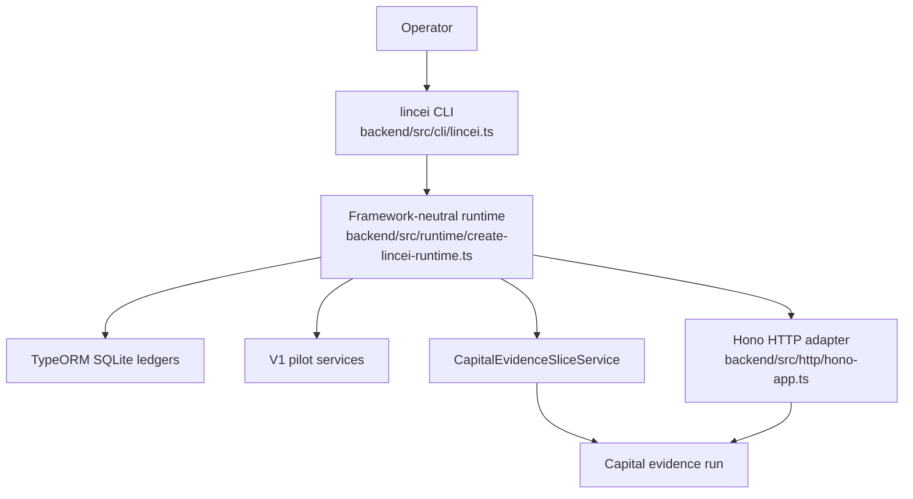
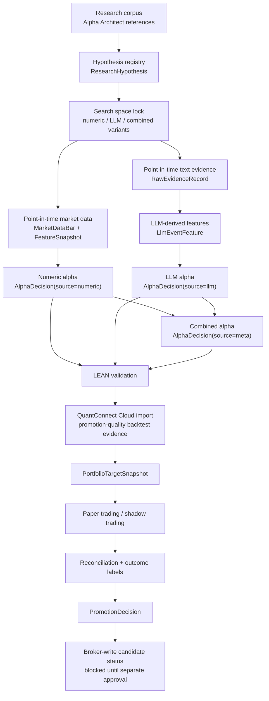
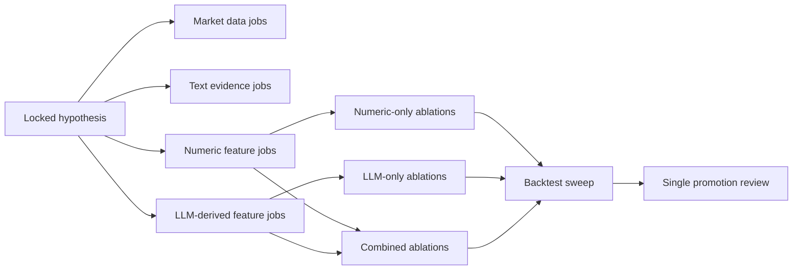

# Lincei Quant Research Engine: Capital Evidence Flow

Status: supporting review note.

Last checked: 2026-05-28 on `Darwin arm64`.

Source of truth: [SPEC.md](SPEC.md), [terminology.md](terminology.md), and `docs/spec/`. This file is not the spec. It explains how the current implementation decides, tests, blocks, and eventually prepares for self-funded capital allocation.

## 1. Current Conclusion

The project is now organized around this capital evidence loop:

`research corpus -> hypothesis -> point-in-time data -> LLM-derived features -> alpha variants -> LEAN / QuantConnect validation -> portfolio target -> paper/shadow -> reconciliation -> promotion decision -> broker-write candidate status`

The latest direct run proves the new CLI/runtime path executes, but it correctly ends as `blocked`.

Latest direct command:

```bash
bun --cwd=backend run lincei -- capital run --max-backtest-workers 1 --json
```

Latest direct run id: `capital-evidence-20260528081047-3d32260289b0`

Latest status: `blocked`

Why blocked:

- Point-in-time market data is not ready. `STOOQ_API_KEY` is missing for the active LEAN universe.
- Alpha generation is blocked because active symbols such as `SMH` have insufficient daily bars.
- No passed variant exists yet. The run retained three blocked ablation variant jobs.
- QuantConnect Cloud REST credentials are missing: `QC_USER_ID` and `QC_API_TOKEN`.
- No accepted LEAN strategy run exists for paper/shadow.
- Promotion decision was created, but it is `blocked`.
- Broker-write candidate remains blocked because real broker writes are still outside the active spec.

## 2. Runtime And CLI Shape



Important implementation note: the CLI is TypeScript and invoked through Bun scripts, but this machine cannot run the TypeORM `better-sqlite3` ledger under Bun's JavaScript runtime. The `lincei` script therefore executes with `ts-node` under Node while still being managed by `bun run`. That avoids a second CLI language and avoids duplicating ledger/risk/promotion logic.

Canonical commands:

```bash
bun --cwd=backend run lincei -- help
bun --cwd=backend run lincei -- capital status --json
bun --cwd=backend run lincei -- capital run --max-backtest-workers 1 --json
```

Legacy script command names still work through `bun run v1:cli -- ...` while migration continues.

## 3. Decision Flow



LLM involvement is before the backtest. The LLM reads point-in-time text evidence and produces typed semantic features and LLM alpha decisions. It does not see broker credentials, it does not create raw broker payloads, and it does not choose final order quantities.

## 4. Actual Latest Run

| Stage | Result | Evidence |
| --- | --- | --- |
| Research corpus | `passed` | 40 hypotheses, 15 P1 candidates |
| Semantic evidence ingest | `passed` | 80 Hugging Face FOMC records created |
| Point-in-time data | `blocked` | Missing `STOOQ_API_KEY`; local LEAN daily export blocked |
| Alpha cycle | `blocked` | Insufficient bars for active universe symbol `SMH` |
| Variant retention | `blocked` | 3 retained ablation jobs, all blocked |
| Local LEAN validation | `skipped` | Data preparation blocked |
| QuantConnect Cloud check | `blocked` | Missing `QC_USER_ID` / `QC_API_TOKEN` |
| Paper cycle | `blocked` | No accepted LEAN strategy run imported |
| Shadow trading | `blocked` | No accepted LEAN run or portfolio target |
| Learning / promotion | `blocked` | Promotion decision created as blocked |
| Broker-write preflight | `blocked` | No current evidence, no real broker-read-only reconciliation, broker-write out of scope |

Retained variants from the latest run:

| Variant | Alpha source | Status | Job id |
| --- | --- | --- | --- |
| `trend-regime-numeric-v1` | `numeric` | `blocked` | `ablation-ca727ce31762` |
| `semantic-llm-v1` | `llm` | `blocked` | `ablation-34381ad35aff` |
| `trend-regime-combined-v1` | `meta` | `blocked` | `ablation-d7bd61350b6e` |

Promotion decision from the latest run:

| Field | Value |
| --- | --- |
| id | `promotion-20260528081102` |
| status | `blocked` |
| attempted variants | 3 |
| failed or blocked variants | 3 |
| passed variants | 0 |

This is useful progress: the system now records losers/blocked variants instead of silently having no variant evidence. It is not yet evidence that a strategy earns money.

## 5. Component I/O

| Component | Input | Output | Ledger/artifact |
| --- | --- | --- | --- |
| Research factory | Alpha Architect index and strategy register | `ResearchHypothesis`, corpus jobs | `research_hypotheses`, `research_job_records` |
| Market data preparation | universe, provider, dataset id | bars, LEAN daily data readiness | `market_data_bars`, LEAN data files |
| Semantic evidence ingest | Hugging Face FOMC CSV or local source file | point-in-time text records | `raw_evidence_records` |
| Feature snapshot builder | market bars with availability timestamps | numeric feature rows | `feature_snapshots` |
| LLM feature builder | raw evidence refs, feature refs, prompt/model version | semantic event/macro/risk features | `llm_event_features` |
| Alpha services | numeric features and LLM-derived features | numeric, LLM, and meta alpha decisions | `alpha_decisions` |
| Capital evidence slice | hypothesis, variants, current ledgers | retained variant jobs and promotion report | `research_job_records`, `promotion_decisions` |
| LEAN / Cloud import | alpha exports, LEAN artifacts, Cloud ids | run metrics and target snapshots | `lean_runs`, `portfolio_target_snapshots`, `artifacts/lean-runs/*` |
| Paper/shadow | portfolio target and risk policy | paper order plan or would-have-traded record | `paper_order_plans`, `live_shadow_records` |
| Pre-trade risk check | promotion, broker read-only snapshot, reconciliation, limits | `ready` or `blocked` | `live_pilot_status_records` |

## 6. Parallelization

Current `capital run` is intentionally single-worker (`--max-backtest-workers 1`) because portfolio target consolidation, paper/shadow, reconciliation, and pre-trade risk checks must remain single-writer.

Safe future parallelism is before promotion:



Rule: parallel jobs may create evidence, but they must not write final portfolio targets, paper/shadow execution intent, reconciliation state, or broker-write status concurrently.

## 7. Money Boundary

Self-funded capital allocation is the main long-term objective, but the current implementation still blocks real account mutation.

Money can enter only after all of these are true:

1. At least one hypothesis has retained numeric-only, LLM-only, and combined variants.
2. A variant has passed direct validation, including real QuantConnect Cloud import.
3. Current paper/shadow evidence exists for the same target.
4. Reconciliation is matched.
5. Outcome labels and promotion decision are recorded.
6. Real broker read-only cash/position/open-order state is reconciled.
7. A separate broker-write spec is explicitly approved.
8. Pre-trade risk check returns `ready`.

Darwinex/Zero remains later. It should use a self-funded-capital deployment-grade signal and track record; it should not be built ahead of the core capital evidence loop.

## 8. Immediate Next Implementation Targets

| Priority | Work | Why |
| --- | --- | --- |
| P0 | Make the selected capital universe and active LEAN universe align | Latest run defaulted to `SPY,QQQ,TLT,IEF`, but active LEAN universe still required symbols like `SMH`. |
| P1 | Provide point-in-time market data without manual blocking | `STOOQ_API_KEY` or another approved data source is required before alpha can run. |
| P2 | Run alpha cycle with real features and retained variant jobs | Need at least one passed and one failed/blocked variant for selected-run-bias protection. |
| P3 | Import real QuantConnect Cloud backtest by `projectId/backtestId` | Local LEAN/simulator is not promotion evidence. |
| P4 | Produce current paper/shadow and reconciliation artifacts | Historical or missing targets do not prove current readiness. |
| P5 | Keep broker writes blocked until the separate spec is approved | This prevents accidental live account mutation before evidence exists. |

## 9. Review Pointers

| File | What to review |
| --- | --- |
| [backend/src/cli/lincei.ts](backend/src/cli/lincei.ts) | New CLI command surface and legacy command compatibility |
| [backend/src/runtime/create-lincei-runtime.ts](backend/src/runtime/create-lincei-runtime.ts) | Framework-neutral service composition and DataSource lifecycle |
| [backend/src/http/hono-app.ts](backend/src/http/hono-app.ts) | Thin Hono adapter over the same runtime |
| [backend/src/modules/v1-pilot/research/capital-evidence-slice.service.ts](backend/src/modules/v1-pilot/research/capital-evidence-slice.service.ts) | Capital evidence vertical slice and retained variant job recording |
| [backend/src/modules/v1-pilot/research/research-factory.service.ts](backend/src/modules/v1-pilot/research/research-factory.service.ts) | Hypothesis registry and selected-run-bias check |
| [backend/src/modules/v1-pilot/live/live-preflight.service.ts](backend/src/modules/v1-pilot/live/live-preflight.service.ts) | Fail-closed broker-write pre-trade risk check |

## 10. Final Judgment

The project is still not ready to trade real money, but the implementation is closer to the right shape. The core gap is no longer "there is no operator CLI"; it is now concrete:

- data source blocked;
- no passed variant;
- no real Cloud import;
- no current target/paper/shadow reconciliation;
- broker-write approval still absent.

That is the right kind of blocked state. It tells us exactly what must be fixed before self-funded capital can be considered.
