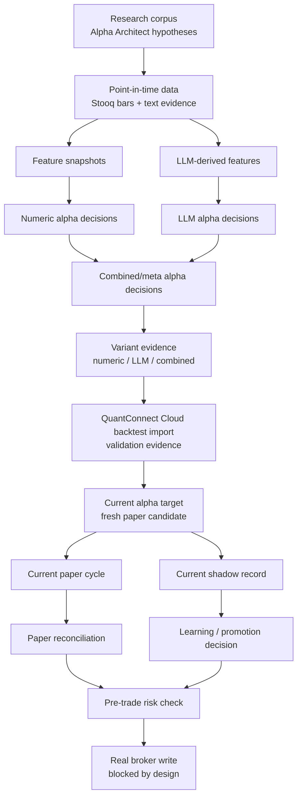

# Lincei Quant Research Engine: Current Capital Evidence Status

Status: supporting review note.

Last checked: 2026-05-29 on `Darwin arm64`.

Source of truth: [SPEC.md](SPEC.md), [terminology.md](terminology.md), and `docs/spec/`. This file explains the current implementation state in plain language. It is not the normative spec.

## 1. One-line Conclusion

The project now has a working current-market paper evidence path:

`fresh alpha decisions -> current portfolio target -> current paper plan -> reconciliation -> current shadow record -> promotion decision -> pre-trade risk check`

It is still **not ready to trade real money** because broker read-only reconciliation, Toss credentials, broker-write readiness flags, and the future broker-write spec are still blocked or missing.

## 2. Current Flow



Important boundary: the LLM participates before backtesting through typed semantic features and LLM alpha decisions. It does not receive broker credentials, does not create raw broker orders, and does not decide final broker quantities.

## 3. What Works Now

| Area | Current result |
| --- | --- |
| Stooq market data | `STOOQ_API_KEY` is configured locally; market ingestion can pass. |
| Alpha replay | Alpha feature and decision ledgers are idempotent. |
| QuantConnect Cloud | Project `32097697` and backtest `ecd033aae81ec9f98e1c24b4c5a58d4c` imported as `qc-import-ecd033aae81e`. |
| Cloud strategy evidence | Cloud run is `passed`, runtime `quantconnect-cloud`, promotion eligible as validation evidence. |
| Cloud target import | Historical Cloud target normalization is fixed. Previous false gross exposure around 48x is now corrected. |
| Current target generation | Latest validated alpha mode is `numeric-only`; current target snapshot is generated from fresh numeric alpha decisions. |
| Current paper cycle | Plan `4` is `reconciled` and `matched`. |
| Current shadow record | `live-shadow-20260529005300` recorded as `current_live_shadow`. |
| Promotion decision | Latest learning run accepted promotion evidence. |
| Pre-trade risk check | Runs fail-closed and now blocks only on broker-readiness items, not paper/current-shadow evidence. |

Latest current target:

| Field | Value |
| --- | --- |
| target id | `current-alpha-target-qc-import-ecd033aae81e-numeric-5e360d0d3d5f` |
| source | current numeric alpha decisions linked to Cloud validation run |
| target count | 2 |
| gross exposure | `0.2` target-weight fraction, about 20% |
| max single-name | `0.1` target-weight fraction, about 10% |
| symbols | `AMD`, `MRVL` |

Latest current paper cycle:

| Field | Value |
| --- | --- |
| plan id | `4` |
| status | `reconciled` |
| reconciliation | `matched` |
| orders | `AMD` buy $1000, `MRVL` buy $1000 |
| broker write | disabled |

Latest promotion decision:

| Field | Value |
| --- | --- |
| id | `promotion-20260529005329` |
| status | `accepted` |
| current live shadow | true |
| cloud runtime | true |
| selected-run-bias check | passed |

## 4. What Is Still Blocked

| Area | Status | Why it matters |
| --- | --- | --- |
| Broker read-only | `blocked` | Current broker snapshot is `simulated`, not a matched Toss read-only poll. |
| Broker credentials | `missing` | Toss credential env or external secret ref is not configured. |
| Broker snapshot reconciliation | `blocked` | Snapshot reconciliation is `not_checked`; matched required before live. |
| Broker-write flags | `not ready` | `brokerWriteEnabled`, `liveTradingEnabled`, schema verification, cancel/flatten, and open-order polling flags remain false. |
| Real broker writes | `deferred` | Requires a separate user-approved broker-write implementation spec. |
| Darwinex/Zero | `deferred` | Should wait until self-funded capital evidence and track record are stronger. |

Latest preflight blocker summary:

```text
status: blocked
main blockers:
- latest broker snapshot is simulated, not Toss read-only
- broker snapshot reconciliation is not matched
- broker credentials are missing
- broker-write/live-trading/schema/cancel/open-order flags are not ready
```

## 5. Next Work, In Order

| Priority | Work | Direct proof |
| --- | --- | --- |
| P0 | Implement Toss read-only account, position, cash, and open-order polling without any write calls. | `preflight run` no longer says broker snapshot is simulated or stale. |
| P1 | Reconcile Toss read-only snapshot against local broker/account state. | Broker snapshot reconciliation becomes `matched`. |
| P2 | Add explicit external secret handling for Toss credentials. | `credentialMode` becomes `external-secret`, not `missing` or `local-dev-env`. |
| P3 | Keep broker-write flags false until a separate broker-write spec is approved. | Preflight remains blocked only by intentionally false write flags. |
| P4 | Draft broker-write spec for user approval after read-only reconciliation is proven. | No submit/cancel/replace/flatten implementation before approval. |

## 6. Commands Used For Review

```bash
bun --cwd=backend run lincei -- paper run --json
bun --cwd=backend run lincei -- shadow run --json
bun --cwd=backend run lincei -- learning run --json
bun --cwd=backend run lincei -- preflight run --json
bun --cwd=backend run lincei -- capital status --json
```

Focused validation:

```bash
cd backend
bun run test -- src/modules/v1-pilot/alpha/current-alpha-target.service.spec.ts src/modules/v1-pilot/paper/lean-paper-bridge.service.spec.ts src/modules/v1-pilot/live/live-preflight.service.spec.ts src/runtime/create-lincei-runtime.spec.ts
```

Result: 4 focused suites / 9 tests passed.
